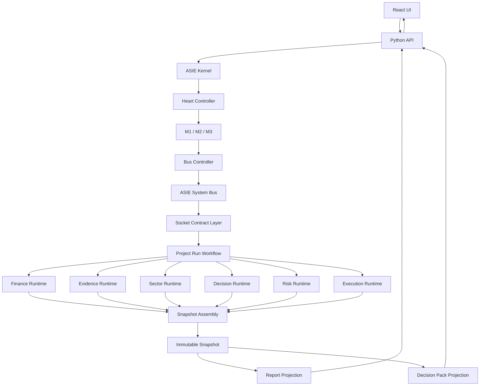

# المواصفة الرئيسية لتصحيح مسار تشغيل المشروع

## 1. المالك التشغيلي

المالك الصحيح لتنسيق تشغيل المشروع هو:

```text
Project Run Workflow داخل Module Runtime
```

وهو آلة حالات تشغيلية ترسل الأوامر عبر Bus/Socket، ولا تستدعي أي محرك مباشرة.

## 2. حد نجاح التشغيل

يعد التشغيل ناجحًا فقط عند:

```text
Snapshot Atomic Commit = committed
Snapshot Hash = verified
Snapshot Immutability = enforced
```

فشل Report أو Decision Pack بعد ذلك لا يلغي Snapshot ولا يعيد الحساب.

## 3. التسلسل الكامل

| المرحلة | من | إلى | العقد | الحارس | المخرج |
|---:|---|---|---|---|---|
| 1 | React UI | Python API | `POST /api/projects/:id/runs` | Auth + ownership + schema + idempotency | طلب تشغيل مقبول |
| 2 | Python API | API Request Guard | `ProjectRunHttpRequest.v1` | لا حسابات أو قيم مشتقة من React | طلب منقّى |
| 3 | Python API | ASIE Kernel | `project.run.request.v1` | لا استخدام لـ`aas.kernel.boot.v1` | Kernel request envelope |
| 4 | Kernel | Heart Controller | `aas.heart.assignment.v1` | Controller وحده يختار القلب | طلب تعيين |
| 5 | Heart Controller | M1/M2/M3 | `aas.heart.assignment.v1` | Health + load + policy | Heart assignment |
| 6 | القلب المختار | Bus Controller | `aas.bus.message.v1` | correlation + audit + sender/target | رسالة مقبولة |
| 7 | Bus Controller | System Bus | `aas.bus.route.v1` | admission + routing + no open broadcast | رسالة موجهة |
| 8 | System Bus | Socket Contract Layer | `socket.project.run` | Socket First + contract validation | طلب تشغيل صالح |
| 9 | Socket Layer | Project Run Workflow | `project.run.workflow.v1` | منع التكرار + run context | Run context مغلق |
| 10 | Run Workflow | Finance Runtime | `finance.calculate.v1` عبر Bus/Socket | Finance مالك الأرقام | طلب Finance |
| 11 | Finance Runtime | Run Workflow | `finance.result.v1` | sealed + output validation | `SealedFinanceResult` |
| 12 | Run Workflow | Evidence Runtime | `evidence.ledger.build.v1` عبر Bus/Socket | dataset quality + source governance | طلب Evidence |
| 13 | Evidence Runtime | Run Workflow | `evidence.ledger.v1` | lineage + coverage | `SealedEvidenceResult` |
| 14 | Run Workflow | Sector Runtime | `sector.intelligence.build.v1` عبر Bus/Socket | taxonomy + evidence binding | طلب Sector |
| 15 | Sector Runtime | Run Workflow | `sector.intelligence.v1` | evidence status لكل معيار | `SealedSectorResult` |
| 16 | Run Workflow | Decision Runtime | `decision.council.evaluate.v1` عبر Bus/Socket | مدخلات مغلقة فقط | طلب Decision |
| 17 | Decision Runtime | Run Workflow | `decision.council.result.v1` | لا Risk/Execution input | `SealedDecisionResult` |
| 18 | Run Workflow | Risk Runtime | `risk.register.build.v1` عبر Bus/Socket | لا execution plan | طلب Risk |
| 19 | Risk Runtime | Run Workflow | `risk.register.v1` | deterministic + sealed | `SealedRiskResult` |
| 20 | Run Workflow | Execution Runtime | `execution.plan.build.v1` عبر Bus/Socket | advisory inputs فقط | طلب Execution |
| 21 | Execution Runtime | Run Workflow | `execution.plan.v1` | لا حساب مالي ولا AI ownership | `SealedExecutionResult` |
| 22 | Run Workflow | Snapshot Assembly | `snapshot.assemble.v1` عبر Bus/Socket | كل النتائج موجودة ومغلقة | Assembly request |
| 23 | Snapshot Assembly | Integrity Validator | `snapshot.integrity.verify.v1` | hashes + lineage + versions | Snapshot candidate |
| 24 | Snapshot Assembly | Immutable Snapshot Store | `snapshot.commit.atomic.v1` | commit كامل أو rollback كامل | Immutable Snapshot |
| 25 | Snapshot Store | Snapshot Assembly | `snapshot.commit.receipt.v1` | post-write hash verification | receipt |
| 26 | Run Workflow | Report Projection | `report.snapshot.project.v1` | بعد commit فقط | report request |
| 27 | Report Projection | Snapshot Store | `snapshot.read.v1` | read-only | snapshot ثابت |
| 28 | Report Projection | Projection Store | `report.snapshot.v1` | لا إعادة حساب | saved report |
| 29 | Run Workflow | Decision Pack Projection | `decision.pack.project.v1` | مستقل عن Report | pack request |
| 30 | Decision Pack Projection | Snapshot Store | `snapshot.read.v1` | read-only | snapshot نفسه |
| 31 | Decision Pack Projection | Projection Store | `decision.pack.v1` | projection only | saved decision pack |
| 32 | Run Workflow | Python API | `project.run.completed.v1` | snapshot success boundary | completion envelope |
| 33 | Python API | React UI | HTTP response | display only | run_id + snapshot_id |

## 4. الرسم المرجعي



## 5. التبعيات الصحيحة

### المجموعة الأولى

- Finance
- Evidence
- Sector

يجوز تشغيلها بالتوازي جزئيًا إذا كانت المدخلات جاهزة.

### المجموعة الثانية

Decision يبدأ بعد إغلاق مخرجات Finance/Evidence/Sector اللازمة.

### المجموعة الثالثة

Risk يبدأ بعد توفر الحكم المغلق والمدخلات الضرورية.

### المجموعة الرابعة

Execution يستقبل فقط ملخصات وقيود مخاطر مغلقة، مثل:

- `risk_advisory_summary`
- `critical_constraints`
- `mitigation_requirements`
- `residual_risk_status`

ولا يستقبل Risk Engine أو كائنًا قابلًا للاستدعاء.

### المجموعة الخامسة

Snapshot Assembly لا يبدأ قبل اكتمال كل المخرجات المطلوبة.

## 6. العقود: أمر مقابل نتيجة

| الوحدة | عقد الأمر | عقد النتيجة |
|---|---|---|
| Finance | `finance.calculate.v1` | `finance.result.v1` |
| Evidence | `evidence.ledger.build.v1` | `evidence.ledger.v1` |
| Sector | `sector.intelligence.build.v1` | `sector.intelligence.v1` |
| Decision | `decision.council.evaluate.v1` | `decision.council.result.v1` |
| Risk | `risk.register.build.v1` | `risk.register.v1` |
| Execution | `execution.plan.build.v1` | `execution.plan.v1` |
| Snapshot | `snapshot.assemble.v1` | `snapshot.commit.receipt.v1` |
| Report | `report.snapshot.project.v1` | `report.snapshot.v1` |
| Decision Pack | `decision.pack.project.v1` | `decision.pack.v1` |

استخدام عقد واحد للأمر والنتيجة يعد ثغرة دلالية ويجب تصحيحه.
