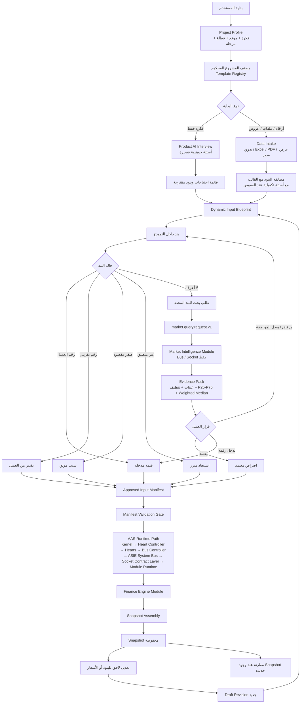

# ACR-DIB-001 - Dynamic Input Blueprint and Approved Input Manifest

| Field | Value |
| --- | --- |
| ACR ID | ACR-DIB-001 |
| Title | Dynamic Input Blueprint and Approved Input Manifest |
| Status | Draft for implementation |
| Requester | ASIE Product Owner |
| Date | 2026-07-23 |
| Repository | alphasigma13579-lang/ASIE |
| Target Branch | main |
| Related Runtime Freeze | AAS Runtime Freeze v1.0 |

## Decision Summary

ASIE must stop treating every project as if it shares one fixed financial input form. The platform has two entry paths, but both must meet at one governed model: `Dynamic Input Blueprint`.

The two entry paths are:

1. A user who only has an idea.
2. A user who already has numbers, estimates, files, PDFs, Excel sheets, or supplier quotes.

The meeting point is not the Finance Engine. The meeting point is the `Dynamic Input Blueprint`, where every item receives a state, reason, source, treatment, and approval path before it can become part of the `Approved Input Manifest`.

The Finance Engine must not read conversational AI output, raw files, unapproved internet prices, or loose UI fields. It reads only approved, normalized assumptions that have passed the manifest validation boundary.

## Master Flow Diagram

## Product Rule

There is no universal input form for all projects.

The blueprint changes according to:

- project idea
- Saudi location
- sector and precise classification
- revenue model: subscription, service, product sale, commission, manufacturing, rental, marketplace, or hybrid
- operating nature: digital, remote, physical site, inventory, equipment, fleet, labor-heavy, or asset-light
- project stage
- financing state
- available user data

## The Two Paths

| Path | User State | Required Behavior | Meeting Point |
| --- | --- | --- | --- |
| Idea-only path | User has only a project idea | Product AI runs a short governed interview and proposes needs/items | Dynamic Input Blueprint |
| Data path | User has numbers, estimates, files, or quotes | Platform maps numbers and extracted records to governed template items | Dynamic Input Blueprint |

Both paths may ask clarifying questions. This does not mean Product AI owns the numbers. The assistant may classify, explain, ask, and propose. It must not calculate final financial metrics, invent cost or revenue numbers, issue a sovereign verdict, or bypass approval.

## Item State Model

Every blueprint item must carry:

- why the item appeared
- current state
- value source
- treatment in Finance
- approval status
- evidence lineage when applicable

Required item states:

| State | Meaning | Finance Treatment |
| --- | --- | --- |
| `VALUE_ENTERED` | User entered a known value | Included after approval |
| `CLIENT_ESTIMATE` | User entered an approximate value | Included after approval with lower confidence |
| `INTENTIONAL_ZERO` | User intentionally set zero and provided a reason | Included as zero; not treated as missing |
| `NOT_APPLICABLE` | Item does not apply to this project model | Excluded with documented reason |
| `UNKNOWN` | User does not know the value yet | Blocks only if required for calculation |
| `EXPERIMENTAL_ESTIMATE` | Candidate estimate from simulated or evidence research | Requires user/reviewer approval before Finance |

Zero is not missing. Zero without a reason is incomplete. Zero with a reason is a valid state.

## Market Research Rule

Research does not start from a generic project idea once the blueprint item exists. It starts only from a specific missing item with enough specification.

Correct example:

- "Commercial shawarma grill, chicken and meat, medium capacity, Saudi Arabia, new or used accepted."

Incorrect example:

- "Restaurant equipment."

The research path must run through:

1. `market.query.request.v1`
2. Socket Contract Layer
3. Market Intelligence Module
4. `market.evidence.pack.v1`
5. user or reviewer approval
6. Approved Input Manifest

Current development mode remains governed:

- AI providers: `DISABLED`
- provider policy: `DENY_ALL`
- external network: `DISABLED`
- research output: simulated development evidence only
- confidence: low unless backed by approved user evidence
- internet prices: candidate assumptions, not final facts

When comparable samples exist, the target method is:

- P25 to P75 as the realistic range
- weighted median as the suggested base
- outlier report for suspicious values
- links and samples as evidence candidates, not truth claims

## Current Code Gap Review

This ACR is required because the current code does not yet support the master flow.

| Area | Current State | Gap |
| --- | --- | --- |
| `backend/finance_engine.py` | `CORE_INPUTS = ["startup_cost", "monthly_fixed_cost", "unit_price", "variable_cost"]` | Fixed positive inputs still define finance readiness |
| `backend/finance_engine.py` | `value <= 0` creates blockers | Intentional zero and not-applicable cannot pass |
| `backend/repository.py` | `meaningful_assumption_value()` treats numeric zero as not meaningful | Zero loses semantic meaning |
| `backend/repository.py` | `default_assumption_records()` excludes empty, zero, disabled, and system fields | No way to preserve zero-with-reason assumptions |
| `src/contracts.ts` | `ProjectInputs` is scalar and static | No `BlueprintItem`, item state, reason, treatment, or evidence chain |
| `backend/asie_local_api.py` | Finance payload uses `"inputs": project.inputs` | Finance does not read `Approved Input Manifest` yet |
| `tests/test_runtime_freeze.py` | Runtime freeze tests protect bus/socket/snapshot path | Good protection; changes must preserve this path |

## Proposed Change

Introduce a governed Dynamic Input Blueprint and Approved Input Manifest without changing the frozen AAS runtime path.

The implementation must add:

- Template Registry for governed project templates
- Question Registry for decisive Product AI interview questions
- Dynamic Input Blueprint model
- Blueprint item state machine
- line-item categories: revenue, capex, opex, asset, variable cost, financing, readiness, market assumption
- custom user-added items
- per-item evidence chain
- per-item approval
- Approved Input Manifest
- Manifest Validation Gate before Finance
- snapshot revision lineage

## Boundary Impact

| Component | Impact |
| --- | --- |
| Kernel | No change. No business logic added. |
| Heart Controller | No change. Still assigns runtime work. |
| Three Hearts | No change. |
| Bus Controller | No change. |
| ASIE System Bus | No new bus. Existing path remains mandatory. |
| Socket Contract Layer | Market contracts may be activated behind existing socket pattern. |
| Module Runtime | No bypass. Finance and Market remain modules behind contracts. |
| Finance Engine Module | Input semantics change from fixed positive fields to approved manifest-derived assumptions. |
| Market Intelligence Module | Development simulation only until a separate external-source ACR is approved. |
| AI Advisory / Product AI | May guide the user and propose items; cannot own numbers or decisions. |
| Snapshot Assembly | Must preserve immutable snapshots and create new snapshots for reruns. |
| Zero Trust | Strengthened by preventing direct UI/AI/market-to-finance paths. |

## AAS Compliance Decision

This ACR is required, but it must remain compliant with AAS Runtime Freeze v1.0.

Allowed:

- add models before Finance
- change validation semantics before Finance
- route market research through `market.query.request.v1`
- keep simulated development evidence
- create new snapshot on rerun

Forbidden:

- direct UI to Finance Engine
- direct Product AI to Finance Engine
- direct Product AI to internet
- direct Market Intelligence to Finance Engine
- adding a new bus
- adding an unapproved runtime layer
- letting AI create final numbers, NPV, IRR, DSCR, or sovereign verdicts
- mutating old snapshots

## Finance Semantics

Finance must no longer ask: "Are all core numbers positive?"

Finance readiness must ask:

1. Is this item required by the chosen project template?
2. If required, does it have an approved value, approved estimate, intentional zero, or not-applicable reason?
3. If unknown, is it a calculation blocker?
4. Is the source lineage recorded?
5. Is the manifest version sealed for this run?

The Finance Engine still computes deterministically. It does not infer missing values.

## Snapshot and Rerun Rule

After a completed run:

- the user may return to the dynamic blueprint
- the user may add, remove, edit, or reprice items
- old snapshots must not be edited
- changes create a `Draft Revision`
- rerun creates a new Snapshot
- comparison shows financial impact, risk impact, readiness impact, payback impact, and financing impact

## Acceptance Criteria

The implementation is not accepted unless these cases pass:

1. SaaS project with no rent, no equipment, no loan, and no fitout can pass when those items are `NOT_APPLICABLE` or `INTENTIONAL_ZERO` with reasons.
2. Shawarma shop path asks decisive questions before proposing equipment.
3. Shawarma equipment research starts from a specific approved item, not a generic "restaurant equipment" query.
4. User with Excel/PDF/manual estimates enters the same Dynamic Input Blueprint as the idea-only user.
5. Zero values are preserved with state and reason.
6. Approximate user numbers can be approved without external evidence, but confidence is marked lower.
7. Missing evidence does not block a development run when required numeric assumptions are approved by the user.
8. Unknown required financial drivers block Finance until resolved.
9. Market research output returns to the same line item.
10. User rejection of a research estimate returns to the item, not directly to Finance.
11. Finance receives only the Approved Input Manifest or manifest-derived normalized inputs.
12. Old snapshots remain immutable.
13. Rerun creates a new snapshot and a comparison.
14. Runtime freeze tests still pass: one ModuleRuntime session, no direct engine calls, one `snapshot.assemble.v1`.
15. External network and real AI providers remain disabled until separate ACR approval.

## Implementation Sequence

1. Add backend models for blueprint item, item state, source type, treatment, approval, and manifest.
2. Add persistence for blueprint revisions and approved manifests.
3. Preserve zero semantics in repository assumption handling.
4. Add Manifest Validation Gate.
5. Modify Finance validation to read manifest-derived semantics.
6. Add deterministic Template Registry and Question Registry.
7. Add UI blueprint editor and per-item state controls.
8. Add file/manual intake mapping into the same blueprint.
9. Add simulated Market Intelligence item research behind bus/socket.
10. Add rerun revision flow and snapshot comparison.
11. Add acceptance tests covering both user paths and runtime freeze invariants.

## Residual Risk

The main risk is pretending the UI is dynamic while the backend still rejects zero or reads raw `project.inputs`. That would make the product look corrected but leave the engine wrong.

The second risk is letting simulated research produce numbers that appear authoritative. Every simulated or external estimate must remain a candidate assumption until approved.

The third risk is allowing file intake to bypass the Product/Template classification step. Files are evidence and data sources, not project definitions by themselves.

## Decision

Draft accepted for implementation planning.

Runtime code changes must proceed under this ACR and must preserve AAS Runtime Freeze v1.0.
