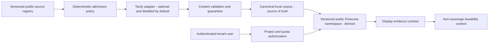

# ACR-FC20-05 - Public Economic Knowledge

- Status: `ACCEPTED FOR OFFLINE/DARK IMPLEMENTATION`
- Program: `FOUNDATION-COMPLETE-20 / FC20-05`
- Baseline: `main@6247a3fed8bb9cd973d36e47379cbff99d492733`
- Rebuilt prerequisite baseline: `main@0a0da250ba507589a645c0c43a92c8ef076dedd4`
- Live provider/network activation: `BLOCKED`
- Public launch: `OUT OF SCOPE`
- Frozen AAS, Finance, Snapshot Assembly, Decision Council v1: `UNCHANGED`

## Decision

FC20-05 adds a platform-owned public economic corpus as a derived knowledge
capability outside the frozen runtime. It is distinct from project evidence and
from procurement suppliers.



No project input, query, prompt, result, snapshot, or customer file may be
written to the public namespace.

## Design drivers

| ID | Driver | Decision |
|---|---|---|
| `FR-05-01` | Fast path for official open data | A version-controlled allowlist may auto-admit official open content; only anomalies are quarantined. |
| `FR-05-02` | Saudi and international context | Saudi official sources govern Saudi claims; World Bank/IMF enrich comparisons. |
| `FR-05-03` | Private research | McKinsey and similar sources remain citation/metadata-only unless a separate permission record allows bounded use. |
| `NFR-05-01` | Tenant isolation | Public writes require an exact platform workload; public reads require an authenticated tenant/project scope. |
| `NFR-05-02` | Rebuildability | The dark-build file corpus is authoritative for offline tests; Pinecone is disposable. Live canary/operation stays blocked until that contract has a durable, backed-up production store. |
| `NFR-05-03` | No regression | Existing project evidence, provider security, AAS, Finance, Snapshot, and Decision contracts remain unchanged. |
| `RISK-05-01` | Poisoning/injection | Retrieved text is untrusted data, never instructions; suspicious content is quarantined before indexing. |
| `RISK-05-02` | Cost/resource exhaustion | Existing provider quotas remain authoritative; batches, chunks, source count, retries, and top-k are bounded. |

## Containers and ownership

| Component | Responsibility | Owned data | Failure isolation |
|---|---|---|---|
| Public source registry | Exact URLs, authority, license, scopes, freshness, admission mode | Versioned configuration | Invalid record blocks only that registry load. |
| Public admission policy | Exact host/path and auto-admission eligibility | No mutable data | Denies before provider transport. |
| Public knowledge sync | Extract, normalize, fingerprint, chunk, version, compensate | Sync transaction state | Source failure is recorded; prior active version remains. |
| Canonical corpus store | Atomic current versions, retained history, tombstones, audit events | Authoritative dark-build corpus | Atomic replace; failed write preserves previous file. A durable production adapter is an exit gate. |
| Pinecone public methods | Derived upsert/search/delete for one fixed namespace | Disposable vectors | Reindex from canonical corpus. |
| Feasibility evidence adapter | Validated evidence display and permitted analytical uses | No persistence | Abstains on incomplete evidence. |

## Tenancy and identity ADR

Decision: use a hybrid model.

- Customer-owned content stays in the existing tenant/project namespace.
- Public economic knowledge uses one fixed versioned namespace.
- Public writes/deletes require `TrustedProviderScope.for_platform_workload`
  for the exact FC20-05 workload.
- Public reads require `TrustedProviderScope.for_tenant`; the request is charged
  and audited to that tenant while the storage namespace remains public.
- A tenant scope cannot call public write/delete methods. A platform workload
  scope cannot be constructed from client input.

Rejected options:

- duplicating the corpus per tenant: wasteful and creates inconsistent versions;
- using `for_platform_preflight` for writes: preflight is intentionally unable
  to authorize live operations;
- exposing a free-form namespace parameter: creates an isolation bypass.

## Data contract and lifecycle

Each indexed record carries:

```text
record_id, source_id, publisher, authority, source_url, license_id,
license_ref, attribution, sector, geography, language, published_at,
retrieved_at, content_sha256, version, freshness_days, fresh_until,
expires_at, unit, confidence, evidence_ref, admission_status,
data_classification, chunk_index, chunk_count
```

Lifecycle:

```text
candidate -> enabled -> fetched -> validated -> active
                         |             |
                         +-> quarantined
active -> superseded -> retained -> expired
active -> deleted_tombstone -> restored | purged by separate authority
```

The canonical corpus retains bounded prior versions. A content hash no-op does
not write Pinecone. Dry-run writes neither corpus nor Pinecone. Delete creates a
tombstone; restore creates a new audit event. Reindex resets only the fixed
public namespace and rebuilds it from active canonical records.

## Data flows

| ID | Trigger | Producer -> Consumer | Contract | Idempotency/failure | Owner |
|---|---|---|---|---|---|
| `PK-INGEST-01` | Manual dry-run/canary | Registry -> bounded Tavily extract/crawl -> Sync | `public-knowledge-source.v1` | every returned URL is re-admitted; hash no-op; prior version survives failure | FC20-05 |
| `PK-INDEX-01` | Valid changed content | Corpus -> Pinecone | `public-knowledge-record.v1` | stable record IDs; compensation on partial write | FC20-05 |
| `PK-READ-01` | Authenticated project query | Tenant scope -> Pinecone -> adapter | `public-knowledge-evidence.v1` | bounded top-k; abstain on invalid hit | Intelligence |
| `PK-DELETE-01` | Explicit maintenance action | Corpus -> Pinecone | tombstone event | exact source IDs; restore available | Platform admin |
| `PK-REINDEX-01` | Explicit recovery | Corpus -> Pinecone | corpus schema version | reset fixed namespace, replay all active records | Platform admin |

## Consistency, recovery, SLO, and cost

- Corpus commit occurs only after the corresponding vector operation succeeds.
- Partial vector writes are compensated from the previous canonical version.
- Retry is delegated to the existing provider control plane; no unbounded loop.
- Default bounds: 20 URLs/extract call, 100 vectors/upsert, 1,000 IDs/delete,
  8,000 characters/record, 50 retrieval hits maximum.
- Dark-build RPO is zero committed-version loss on one persistent filesystem;
  production RPO/RTO remain unproven until a durable store, backup, restore, and
  disaster-recovery exercise pass.
- Pinecone outage degrades semantic retrieval to `temporarily_unavailable`;
  it does not affect Finance, Snapshot, or an existing project run.
- Live schedule stays absent until explicit provider/network authority, a dry
  run, a bounded canary, durable corpus storage, cost evidence, and rollback
  exercise succeed.

## Threat to control to test

| Threat | Control | Required test |
|---|---|---|
| Tenant writes public corpus | Exact proof-bearing platform workload scope | tenant and forged scope denied before transport |
| Cross-tenant customer leakage | Fixed public-only fields; no customer fields accepted | forbidden metadata and tenant write negatives |
| SSRF/source widening | Exact HTTPS host/path registry admission plus existing DNS pinning | private IP, foreign host, path escape denied |
| Prompt injection/poisoning | Content treated as data; deterministic marker scan and quarantine | direct/indirect injection fixtures not indexed |
| Stale, conflicting, or index-tampered evidence | version, derived freshness, expiry, confidence, exact evidence lineage, safe license reference | stale/expired/tampered hit abstention tests |
| Partial update | canonical prior version plus compensation | fail mid-upsert/delete and prove prior recovery |
| Resource exhaustion | bounded sources/chunks/batches/top-k and provider quotas | maximum-bound and over-bound tests |
| Destructive reindex or tombstone resurrection | fixed namespace, platform scope, explicit restore, audit | tenant/preflight denied; deleted source skipped by sync; rebuild parity |

## RAG and AI decision

Retrieval is justified because the corpus is multilingual, changes over time,
and users need semantically relevant evidence. Ingestion, admission, hashing,
versioning, freshness, deletion, and evidence validation remain deterministic.
No model is needed for these controls.

Any later narrative model receives structured evidence records in a clearly
untrusted data section. It may summarize or compare but may not execute source
instructions, invent missing units/dates, calculate sovereign financial
metrics, issue a funding verdict, or write tools. Missing or conflicting
evidence returns an abstention and gap list. Provider/model routing remains
disabled and requires a separate AIA activation decision.

## Deployment and rollback

- Build and tests are offline; fake transports must expose the real client
  signatures and security contexts.
- Manual workflow remains dry-run by default and exact-head gated.
- Canary is one allowlisted public source with bounded records and no customer
  data. It is not authorized by this ACR.
- Kill switches and default-disabled provider policy remain unchanged.
- Code rollback removes FC20-05 public methods. Data rollback restores the last
  canonical version and reindexes the fixed public namespace.

## Exit gates

1. All focused contract, lifecycle, isolation, injection, and recovery tests pass.
2. Full Python/frontend/cross-platform gates pass at exact head.
3. Frozen-file hashes are unchanged.
4. CodeRabbit and Copilot findings are independently adjudicated.
5. No Critical/High finding is open and no review is pending.
6. Durable corpus persistence, backup/restore evidence, and concurrency control
   are proven before any non-dry recurring operation.
7. Live activation remains blocked until a separate explicit authorization.
