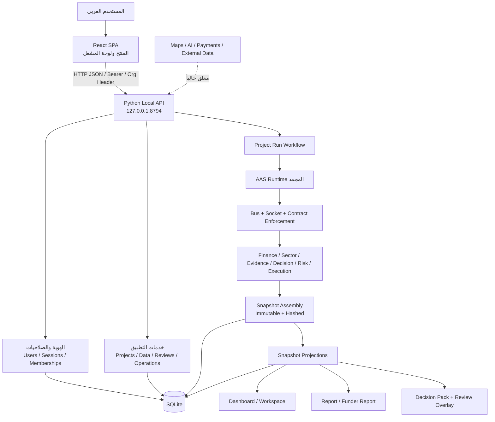
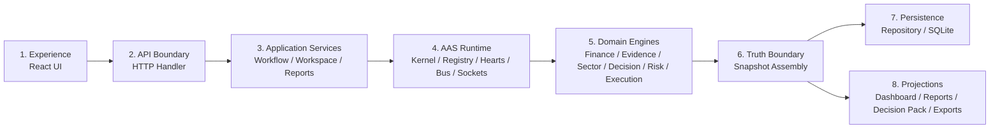
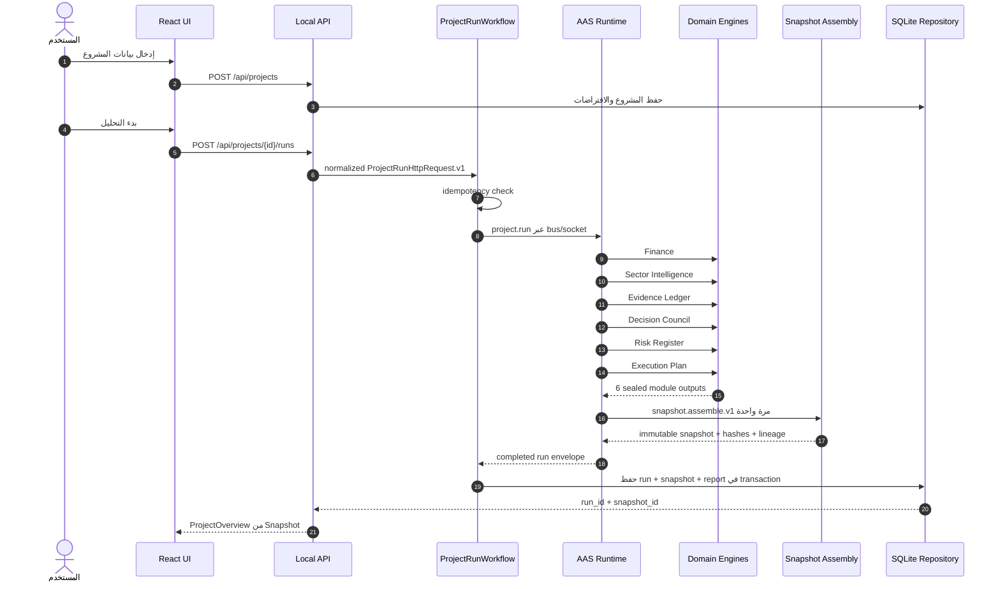
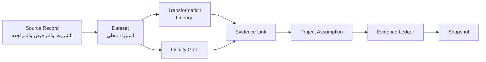
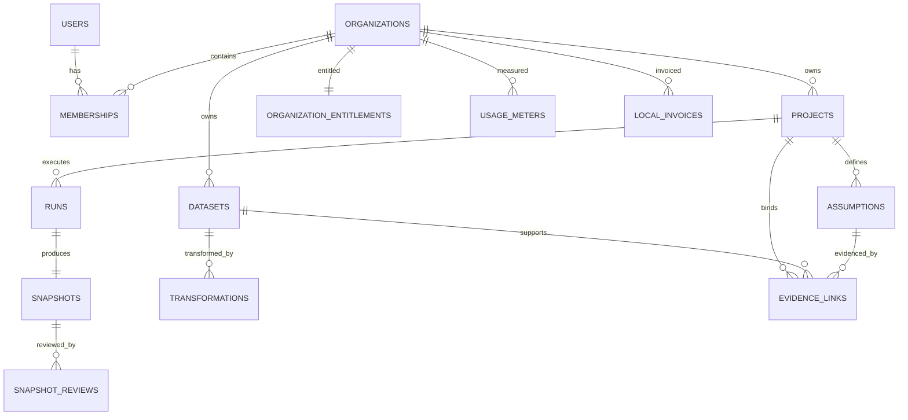
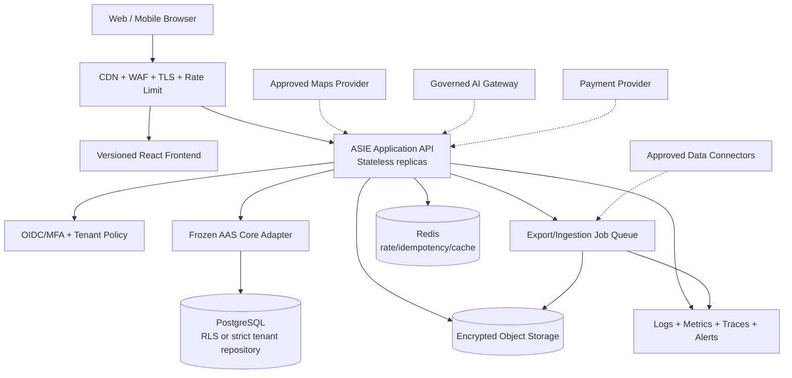

# المعمارية الكاملة لمنصة ASIE

**الإصدار الموثق:** r11 — Local Core  
**تاريخ المراجعة:** 21 يوليو 2026  
**حالة الوثيقة:** وصف معماري تنفيذي كما هو موجود في المستودع، مع فصل واضح عن المعمارية المستهدفة  
**نطاق المراجعة:** الواجهة، API، الهوية والعزل، التخزين، الأدلة، Runtime، المحركات، Snapshot، التقارير، التشغيل، الأمن، الاختبارات، والفجوات

---

## 1. الخلاصة التنفيذية

ASIE في حالتها الحالية هي **منصة تحليل قرار ودراسة جدوى محلية مبنية كـ Modular Monolith**. واجهتها React/TypeScript، وخادمها Python محلي متعدد الخيوط، وقاعدة بياناتها SQLite. داخل الخادم توجد نواة تشغيل تعاقدية مجمّدة تسمى AAS Runtime، تمرر كل تشغيل مشروع عبر عقود ورسائل ومقابس مسجلة، ثم تجمع مخرجات ستة محركات في Snapshot غير قابل للتغيير منطقياً. جميع التقارير والداشبورد وحزمة القرار يجب أن تكون إسقاطات من هذا الـSnapshot، لا حسابات مستقلة في الواجهة.

قوة المعمارية الأساسية ليست في الواجهة الحالية، بل في أربع خصائص:

1. **مصدر حقيقة واحد:** Snapshot مجمّع ومحفوظ مع بصمات تكامل.
2. **فصل الملكيات:** كل محرك يملك نتيجة محددة، ولا يُسمح لمحرك آخر أو للواجهة بإعادة حسابها.
3. **قابلية التتبع:** العقود، الرسائل، معرفات الارتباط، الأدلة، الافتراضات، والتحويلات تربط المدخل بالقرار.
4. **حوكمة التغيير:** ملفات الـRuntime الجوهرية مجمّدة ولا تتغير دون طلب تغيير معماري ACR.

لكنها **ليست بعد معمارية SaaS جاهزة للإطلاق الخارجي**. لا يوجد حالياً نشر سحابي، ولا قاعدة بيانات شبكية، ولا طابور رسائل موزع، ولا تخزين كائنات، ولا مزود خرائط حي، ولا مزود ذكاء اصطناعي، ولا بوابة دفع، ولا بريد أو رسائل، ولا مراقبة إنتاجية موزعة. التشفير الاحتياطي مؤجل، ومصفوفة اختبار العزل على كل المسارات غير مكتملة، وواجهة التصدير لا توصل وظائف DOCX/PDF/PPTX إلى المستخدم بعد.

### القرار المعماري الحالي

لا أوصي بتقسيم المنصة الآن إلى Microservices. المعمارية الأنسب للمرحلة الحالية هي إبقاء **Modular Monolith تعاقدية**، وتحسين حدود الوحدات والعزل والتشغيل والواجهة. الانتقال إلى خدمات مستقلة يجب أن يحدث فقط عندما يثبت حمل إنتاجي أو حاجة استقلال نشر أو فريق مستقل لكل مجال. الفصل المبكر الآن سيزيد التكلفة التشغيلية ويضعف سرعة إغلاق بوابات الأمن وتجربة المستخدم.

---

## 2. حدود الحقيقة في هذه الوثيقة

### منفذ فعلياً

- React 19 + TypeScript + Vite 7.
- Python Standard Library HTTP API باستخدام `ThreadingHTTPServer`.
- SQLite محلية.
- هوية محلية، أدوار وصلاحيات، جلسات Bearer، وعضويات مؤسسات.
- تشغيل مشروع عبر AAS Runtime والعقود والحافلة والمقابس.
- ستة مخرجات محركات إلزامية وتجميع Snapshot واحد.
- حفظ ذري للتشغيل والـSnapshot بعد التحقق من البصمات.
- أدلة، مجموعات بيانات، تحويلات، مراجعة بشرية، وتقارير مشتقة من Snapshot.
- إسقاط تقرير تمويلي، وتوليد HTML، ووظائف تصدير DOCX/PDF/PPTX في طبقة الخادم.
- نسخ احتياطي واستعادة محليان كوظائف خادم، مع checksum وفحص SQLite.
- اختبارات آلية ناجحة: 162، ومتخطى واحد مرتبط ببيئة تصدير DOCX.
- بناء الواجهة وCompile للخادم ناجحان في تحقق 21 يوليو 2026.

### موجود جزئياً أو محلياً فقط

- العزل متعدد المؤسسات موجود في النموذج والصلاحيات وعدد من المسارات، لكنه لم يحصل بعد على مصفوفة اختبار سلبية شاملة لكل endpoint.
- التحكم التجاري محلي: اشتراكات وحصص وفواتير غير محصلة وإشعارات داخلية، دون دفع فعلي.
- Live Cockpit موجود كعرض محلي/تجريبي وليس مصدراً حياً معتمداً.
- GPS موجود في الواجهة، لكنه يحتاج تحققاً عملياً للموافقة والأخطاء وتطبيع العنوان. ترويسة `Permissions-Policy` المغلقة موجودة على استجابات API/HTML الخلفية؛ وهي لا تحكم صفحة Vite المحلية تلقائياً، لكنها ستمنع GPS إذا أعيد استخدامها لاحقاً على وثيقة SPA عبر reverse proxy.
- التصدير البرمجي موجود، لكن لا توجد endpoints أو تجربة مستخدم كاملة لتنزيل DOCX/PDF/PPTX.
- استرجاع كلمة المرور محلي وآمن من حيث token، لكنه ليس مربوطاً بقناة إرسال خارجية.

### غير منفذ أو مؤجل

- Google Maps أو أي مزود خرائط خارجي حي.
- AI provider فعلي أو استدعاء شبكي لنموذج.
- مدفوعات وفوترة إلكترونية حقيقية.
- بريد، SMS، WhatsApp، أو Push خارجي.
- نشر سحابي، Kubernetes، Container orchestration، CDN، WAF، أو Load Balancer.
- قاعدة بيانات إنتاجية مشتركة متعددة العقد.
- Queue/Event Broker موزع.
- تشفير النسخ الاحتياطية وإدارة مفاتيح مركزية.
- مراقبة مركزية Production observability وتنبيه خارجي.

---

## 3. الخريطة المعمارية العليا

### خصائص النمط الحالي

| البعد | القرار الحالي | المعنى |
|---|---|---|
| نمط التطبيق | Modular Monolith | نشر واحد للخادم، مع فصل منطقي قوي بين الوحدات |
| الواجهة | Single Page Application | React تعمل محلياً وتستهلك `/api` |
| API | REST-like local JSON API | خادم Python دون framework خارجي |
| التخزين | SQLite | مناسب للمرحلة المحلية، غير مناسب وحده للتوسع الأفقي |
| التكامل الداخلي | In-process Bus/Socket contracts | ليس Message Broker شبكياً، بل ضبط تعاقدي داخل العملية |
| الاتساق | Transactional local persistence | حفظ run وsnapshot في transaction واحدة |
| الحقيقة التحليلية | Immutable Snapshot | التقارير والقرار والواجهة إسقاطات فقط |
| الشبكة الخارجية | Deny by default | المصادر والمزودون الخارجيون معطلون |
| تعدد المؤسسات | Pool model منطقي | جداول مشتركة مع `organization_id` وحراسة صلاحيات على الخادم |

---

## 4. الطبقات ومسؤولية كل طبقة

### 4.1 طبقة التجربة Experience Layer

الملفات الأساسية:

- `src/main.tsx`: نقطة تركيب التطبيق، وتختار `AdminConsole` عند hash يساوي `#admin`، وإلا تعرض `App`.
- `src/App.tsx`: المنتج الرئيسي، مراحل الرحلة، إدارة الحالة، استدعاءات API، صفحات المشروع والقرار والتنفيذ.
- `src/LiveCockpit.tsx`: لوحة تفاعلية محلية/تجريبية.
- `src/AdminConsole.tsx`: لوحة المشغّل والإدارة.
- `src/api.ts`: عميل HTTP typed لجميع الوظائف المستخدمة من الواجهة.
- `src/contracts.ts`: عقود TypeScript للـDTOs.
- `src/styles.css`: نظام العرض والتجاوب وRTL.

الملاحة الحالية ليست React Router؛ تعتمد على state و`window.history` وhash. هذا يجعلها خفيفة، لكنه يضعف deep links، route guards، استعادة الصفحة، وتحليل المسارات. لاحقاً ينبغي الانتقال إلى Router صريح دون تغيير منطق الحقيقة.

المراحل المنتجية الموجودة في التطبيق تشمل: لوحة التحكم، معالج إنشاء المشروع، اختبار الواقع، الأدلة، الجاهزية، بدء التحليل، القرار، التنفيذ، وسجل اللقطات. المسار المرغوب للمستخدم هو:

> موقع العميل ← القطاع ← التصنيف الدقيق ← اسم المشروع ← الفجوة والميزة ← الجمهور ← رأس المال ← تفاصيل المشروع

لا ينبغي أن يرى المستخدم في هذه الرحلة عقود Runtime أو Monte Carlo أو Snapshot assembly. تظهر النتائج المبسطة في لوحة القرار، بينما تُحفظ التفاصيل الفنية في «تفاصيل المشروع» أو سجل التدقيق.

### 4.2 طبقة API

`backend/asie_local_api.py` هو Composition Root وHTTP adapter في آن واحد. ينشئ repository وruntime ويعرّف المسارات ويطبق المصادقة والتفويض والترويسات الأمنية ومعالجة الأخطاء.

الخصائص الحالية:

- الاستماع على `127.0.0.1:8794` افتراضياً.
- `ThreadingHTTPServer` لمعالجة الطلبات محلياً.
- JSON request limit مقداره 1 MiB.
- Rate limiter محلي داخل الذاكرة: 120 طلباً لكل 60 ثانية حسب IP + verb + path.
- Request ID لكل طلب.
- Error envelope موحد: `error`, `status`, `request_id`.
- CORS يسمح فقط بـ `127.0.0.1:5194` و`localhost:5194`.
- لا Cookies؛ الجلسة Bearer token، لذلك نموذج CSRF التقليدي غير مستخدم حالياً.

هذه الطبقة تعمل لكنها كبيرة جداً؛ ملف API يقارب 90KB ويجمع routing وauthorization وorchestration. الهدف اللاحق هو فصلها إلى controllers حسب المجال مع إبقاء السلوك والعقود كما هي.

### 4.3 طبقة خدمات التطبيق

تشمل:

- `workflow.py`: جاهزية خطوات إنشاء المشروع.
- `workspace.py`: تجميع مساحة المشروع من البيانات المحفوظة.
- `readiness_gates.py`: بوابات المالية والتشغيل والأدلة والمصادر وخدمة الدين والإطلاق.
- `acceptance.py`: حزمة قبول التشغيل.
- `reports.py`: إسقاط التقرير وعرضه وHTML.
- `decision_pack.py`: حزمة القرار والمراجعة البشرية وعناصر الإجراء.
- `funder_report.py`: إسقاط التقرير التمويلي من Snapshot.
- `funding_readiness.py`: فحص مرجعي حتمي لمتطلبات تمويلية داخلية.
- `report_release.py`: سجل مراجعة وإطلاق التقرير.
- `operations.py` و`release_info.py`: الصحة التشغيلية وحالة الإصدار.
- `recovery.py`: النسخ الاحتياطي والاستعادة المحلية.

هذه الطبقة لا يجوز أن تعيد احتساب ملكيات المحركات؛ هي تنسق أو تسقط بيانات محفوظة.

### 4.4 طبقة AAS Runtime

هذه هي النواة المجمدة، وتتكون من:

- `aas_kernel.py`: إعداد النواة والتحقق من profile والمنافذ ومنع external fetch وAI.
- `aas_registry.py`: سجل الوحدات والعقود والمقابس والإصدارات والملكيات.
- `heart_controller.py` و`hearts.py`: حالة القلوب الثلاثة وتعيين القلب النشط.
- `bus_controller.py`: السماح برسائل الحافلة بعد جاهزية kernel/heart.
- `system_bus.py`: نقل الرسالة الموثقة داخل العملية.
- `socket_contracts.py`: إنفاذ مبدأ Socket First, Module Second.
- `module_runtime.py`: تسجيل adapters وتنفيذ الوحدات وختم المخرجات.
- `project_run_workflow.py`: غلاف تشغيل المشروع وidempotency وتسلسل التشغيل.
- `snapshot_assembly.py`: التحقق من المخرجات المختومة وتجميع Snapshot.
- `runtime_freeze.py`: التحقق من تجميد الملفات وبصماتها.

الـRuntime لا يملك منطق دراسة الجدوى نفسه. مسؤوليته هي **الضبط، الهوية، العقود، الترتيب، الختم، والتجميع**.

### 4.5 طبقة محركات المجال

| المحرك | الملكية | المدخل الرئيس | المخرج المعتمد |
|---|---|---|---|
| Finance | الحسابات المالية والسيناريوهات | مدخلات المشروع | `finance.result.v1` |
| Sector Intelligence | سياق القطاع ومعايير الاستثمار | المشروع والتصنيف والأدلة | `sector.intelligence.v1` |
| Evidence Ledger | تغطية الأدلة والثقة والروابط | الافتراضات والبيانات والتحويلات | `evidence.ledger.v1` |
| Decision Council | التقييم الحتمي والحكم السيادي | المالية والقطاع والأدلة | `decision.council.v1` |
| Risk Engine | سجل المخاطر وملخصه الاستشاري | النتائج السابقة | `risk.register.v1` + ملخص مخاطر مخفض |
| Execution Engine | خطة التنفيذ | الحكم والجاهزية وملخص المخاطر المخفض | `execution.plan.v1` |

### 4.6 طبقة الحقيقة Snapshot Boundary

`snapshot_assembly.py` هو الحد الذي تتحول عنده نتائج التشغيل إلى حقيقة قابلة للحفظ والعرض. لا يُقبل Snapshot إلا عند وجود المخرجات الستة الصحيحة والمختومة، مع تطابق project/run/snapshot IDs، وتطابق المنتج والعقد، وصحة hash لكل مخرج.

### 4.7 طبقة التخزين

`repository.py` هو Data Access Layer الوحيد تقريباً. ينشئ schema، ينفذ migrations إضافية، ويعزل SQL عن المحركات والواجهة. الحفظ الحالي محلي في ملف `backend/asie_local.sqlite3` أو مسار `ASIE_DB_PATH`.

### 4.8 طبقة الإسقاطات والتصدير

كل من الآتي مستهلك للحقيقة، وليس مالكاً لها:

- Project Overview.
- Dashboard KPIs.
- Report JSON وReport View.
- HTML report.
- Funder report projection.
- Decision Pack.
- Human review overlay.
- DOCX/PDF/PPTX export functions.

---

## 5. مسار تشغيل المشروع من البداية إلى النهاية

### قواعد التشغيل الملزمة

1. طلب التشغيل يقبل فقط الحقول المسموحة مثل `scenario_id`, `operation_id`, `idempotency_key`.
2. لا يبدأ module قبل تحقق kernel وheart وbus وsocket contract.
3. كل رسالة تحمل source/target module، contract، socket، correlation، audit، operation، idempotency، وinput hash.
4. كل مخرج مجال يُختم في `aas.sealed.module.output.v1`.
5. لا يمكن ختم output key مرتين في التشغيل نفسه.
6. لا يمكن تنفيذ module جديد بعد بدء assembly.
7. `snapshot.assemble.v1` ينفذ مرة واحدة فقط لكل run scope.
8. لا يحفظ الـSnapshot إلا بعد التحقق من hashes والإسقاطين overview/report.
9. إعادة الطلب بنفس idempotency key وبنفس المحتوى تعيد النتيجة المكتملة؛ تعارض المحتوى يرفض.

---

## 6. العقود والمقابس والوحدات

### 6.1 تسلسل عقود المجال المجمد

1. `finance.calculate.v1`
2. `sector.intelligence.build.v1`
3. `evidence.ledger.build.v1`
4. `decision.council.evaluate.v1`
5. `risk.register.build.v1`
6. `execution.plan.build.v1`
7. `snapshot.assemble.v1`

### 6.2 عقود البنية التحتية

- `aas.kernel.boot.v1`
- `aas.registry.snapshot.v1`
- `aas.heart.status.v1`
- `aas.heart.assignment.v1`
- `aas.bus.status.v1`
- `aas.bus.message.v1`
- `aas.socket.enforcement.v1`
- `aas.module.execution.v1`
- `aas.sealed.module.output.v1`
- `snapshot.projection.support.v1`

### 6.3 عقود workflow والإسقاطات

- `ProjectRunHttpRequest.v1`
- `project.run.request.v1`
- `project.run.workflow.v1`
- `project.run.completed.v1`
- `report.snapshot.project.v1` → `report.snapshot.v1`
- `decision.pack.project.v1` → `decision.pack.v1`
- `ai.integration.request.v1` → `ai.integration.result.v1`

### 6.4 المقابس المسجلة

- `socket.kernel.boot`
- `socket.registry.snapshot`
- `socket.heart.status`
- `socket.heart.assignment`
- `socket.bus.status`
- `socket.bus.message`
- `socket.contract.enforcement`
- `socket.module.execution`
- `socket.project.run`
- `socket.finance.evaluate`
- `socket.evidence.ledger`
- `socket.sector.intelligence`
- `socket.decision.council`
- `socket.risk.register`
- `socket.execution.plan`
- `socket.snapshot.assemble`
- `socket.ai.integration`
- `socket.decision.pack`
- `socket.report.snapshot`

### 6.5 الوحدات المسجلة

**البنية التحتية:** kernel، registry، heart controller، القلوب M1/M2/M3، bus controller، system bus، socket layer، module runtime.  
**المجال:** project run workflow، finance، evidence ledger، sector intelligence، decision council، risk engine، execution engine، snapshot assembly، reports، decision pack، AI integration.

### 6.6 القلوب الثلاثة

- Primary Heart: القلب النشط الطبيعي.
- Assist Heart: جاهز للمساندة.
- Reserve Heart: احتياطي للفشل.

هذه القلوب ليست compute cluster ولا تنفذ الحسابات المالية. هي طبقة حالة وتحكم وتعيين داخل Runtime المحلي. تحويلها لاحقاً إلى عقد مستقلة ليس مطلوباً قبل وجود حاجة تشغيلية حقيقية.

---

## 7. بنية Snapshot وسلسلة النزاهة

### 7.1 المخرجات الستة الإلزامية

| Output key | Producer module | Producer contract |
|---|---|---|
| `finance_result` | `module.finance` | `finance.result.v1` |
| `evidence_ledger` | `module.evidence_ledger` | `evidence.ledger.v1` |
| `sector_intelligence` | `module.sector_intelligence` | `sector.intelligence.v1` |
| `decision_result` | `module.decision_council` | `decision.council.v1` |
| `risk_result` | `module.risk_engine` | `risk.register.v1` |
| `execution_result` | `module.execution_engine` | `execution.plan.v1` |

### 7.2 شكل المخرج المختوم

يحمل كل sealed envelope على الأقل:

- `envelope_id`
- `envelope_contract_id`
- `output_key`
- `producer_module_id`
- `producer_contract_id`
- `producer_contract_version`
- `project_id`, `run_id`, `snapshot_id`
- `message_id`, `correlation_id`, `audit_ref`
- `produced_at`
- `output`
- `output_hash`
- `sealed: true`

### 7.3 تحقق assembly

يرفض المجمع الحالات التالية:

- حقل زائد أو حقل مطلوب مفقود في input envelope.
- output key غير مسجل أو مكرر.
- module أو contract لا يملك output key.
- عدم تطابق project/run/snapshot IDs.
- عدم تطابق الهوية الداخلية للمخرج مع الغلاف.
- غياب contract version.
- hash غير صحيح.
- نقص أحد المخرجات الستة.
- تكرار supporting output.

الناتج يحتوي على module outputs، supporting outputs، project context، readiness state، blockers، lineage مرتبة، correlation map، `content_hash` و`integrity_hash`، وعلامة `immutable: true`.

### 7.4 معنى عدم القابلية للتغيير

عدم القابلية للتغيير هنا **منطقية وتعاقدية**، وليست تخزين WORM فيزيائياً. API لا يقدم تعديل Snapshot، والإسقاطات تتحقق من hashes، لكن SQLite كملف يمكن لمشغل النظام ذي وصول كامل للنظام تعديله. للإطلاق الخارجي يلزم append-only audit أو storage controls وتشفير ومراقبة أقوى.

---

## 8. المحركات الحسابية والتحليلية

### 8.1 المحرك المالي

`finance_engine.py` يملك الحسابات المالية. من وظائفه:

- التحقق من اكتمال المدخلات وإرجاع blockers بدلاً من اختراع أرقام.
- بناء baseline والسيناريوهات.
- الإيرادات والتكاليف التشغيلية والرأسمالية.
- التدفقات النقدية.
- NPV وIRR.
- خدمة الدين وDSCR.
- حساسية تشغيلية ومالية.
- Monte Carlo حتمي باستخدام seed ثابت عندما تكتمل مدخلاته.
- حالة `NOT_READY` عندما تكون المدخلات غير كافية.

كل output مالي يستخدم envelope يحتوي على الخوارزمية والإصدار والوحدة والفترة والجغرافيا والأدلة والافتراضات والثقة وحالة النتيجة.

### 8.2 ذكاء القطاع

`sector_intelligence.py` يبني taxonomy وسياق القطاع وخريطة أدلة القطاع ومعايير التقييم وحزمة إشارات استثمارية. هو لا يتصل حالياً بالإنترنت؛ يعتمد على المدخلات والسجلات المحلية والمصادر المراجعة.

### 8.3 دفتر الأدلة

`evidence_ledger.py` يجمع الأدلة المرتبطة بالافتراضات، يحسب التغطية والثقة، ويحدد الفجوات. لا يكفي وجود Dataset؛ يجب أن تمر بجودة ومراجعة وربط وتحويل قابل للتتبع.

### 8.4 مجلس القرار

`decision_council.py` تقييم حتمي، وليس تصويت LLM. يستهلك نتائج معتمدة ويصدر نتيجة سيادية واحدة مع rationale. الذكاء الاصطناعي لا يملك حق تغيير verdict.

### 8.5 محرك المخاطر

`risk_engine.py` ينتج سجل مخاطر كامل، ثم ينتج `risk.advisory.summary.v1` مخفضاً. هذا يمنع تمرير سجل المخاطر الكامل إلى محرك التنفيذ دون حاجة، ويحافظ على حد ملكية واضح.

### 8.6 محرك التنفيذ

`execution_engine.py` يبني خطة عمل من الحكم والجاهزية والملخص الاستشاري للمخاطر. يتحقق صراحة من عقد الملخص ويرفض مدخلاً يخرق الحد التعاقدي.

### 8.7 غلاف الذكاء الاصطناعي

`ai_integration.py` وadapter الخاص به يشكلان حداً محكوماً فقط. السياسة الحالية:

- لا مزود فعلي.
- لا استدعاء شبكة.
- لا ملكية للأرقام أو المالية أو المصادر أو القانون أو الحكم.
- يمكن مستقبلاً أن يقترح نصوصاً أو أسماء أو شرحاً أو مساعدة إدخال، مع تمييز الاقتراح عن الحقيقة.

---

## 9. معمارية الأدلة والبيانات الخارجية

### 9.1 سجل المصدر

يخزن الناشر، route، الحالة، URL، رابط الشروط، hash للشروط، مرجع نسخة الترخيص، attribution، التصنيف، فحص الخصوصية، فحص NCA، الغرض المشروع، المراجع، القرار، التاريخ، والملاحظات.

حالات المصدر: `candidate`, `blocked`, `enabled`, `reference_only`. لا يصبح المصدر enabled دون اكتمال الحقول المطلوبة والمراجعة.

### 9.2 Dataset

طرق الاستيراد الحالية محلية: CSV/JSON/table وXLSX base64. يتم حفظ الأعمدة والمعاينة وعدد الصفوف وبيانات الجودة والمراجعة. حالات Dataset: draft، review required، approved for use، rejected، archived.

### 9.3 التحويلات

التحويل يسجل operation type، input columns، filters، aggregation، output value/unit، الحالة، ملاحظات المراجعة، وlineage. الهدف أن يكون الرقم النهائي قابلاً للعودة إلى الملف والعمود والتحويل.

### 9.4 رابط الدليل

يربط مشروعاً وافتراضاً أو target آخر بـDataset وتحويل ومرجع دليل وقرار مراجعة بشرية. هذا الربط هو الذي يجعل الرقم «مدعوماً» بدلاً من مجرد رقم مدخل.

### 9.5 القيود الحالية

- لا ingestion حي أو scheduler.
- لا connectors حكومية أو تجارية.
- لا crawler أو scraping.
- لا object storage للملفات الأصلية.
- `preview_json` داخل SQLite ليس مخزناً مناسباً لأحجام كبيرة.
- البيانات الخارجية ما زالت 15–25% تقريباً من الجاهزية المستهدفة.

---

## 10. نموذج البيانات وقاعدة SQLite

### 10.1 مجموعات الجداول

| المجال | الجداول | الغرض |
|---|---|---|
| الهوية | `users`, `sessions`, `password_recovery_tokens` | المستخدمون والجلسات والاسترجاع |
| المؤسسات | `organizations`, `memberships` | المستأجر والأدوار |
| الحوكمة | `security_audit_events`, `platform_incidents`, `organization_data_requests` | التدقيق والحوادث وطلبات البيانات |
| التجاري المحلي | `organization_entitlements`, `usage_meters`, `local_invoices`, `subscription_change_events` | الخطط والحصص والفواتير والسجل |
| التواصل المحلي | `notifications`, `support_threads` | إشعارات داخلية ودعم |
| المشروع | `projects`, `assumptions`, `action_item_states` | المدخلات وحالة التنفيذ |
| التشغيل والحقيقة | `runs`, `snapshots`, `snapshot_reviews` | التشغيل واللقطة والمراجعة |
| الأدلة | `source_records`, `datasets`, `transformations`, `evidence_links` | سلسلة المصدر إلى الافتراض |

### 10.2 علاقات البيانات الجوهرية

### 10.3 نموذج العزل الحالي

النموذج هو **Pool tenancy**: قاعدة وجداول مشتركة، والفصل بواسطة `organization_id` والتفويض على الخادم. المشروع وDataset مرتبطان بالمؤسسة؛ run وsnapshot يصلان إليها عبر project. توجد مؤسسة توافق قديمة `org_local_legacy` لدعم بيانات ما قبل الهوية.

هذا جيد للمرحلة المحلية، لكنه يحتاج قبل الإنتاج:

- قيود foreign keys كاملة ومفعلة فعلياً في كل اتصال.
- `organization_id NOT NULL` على كل كيان tenant-owned بعد إنهاء legacy migration.
- فهارس مركبة تبدأ بـorganization_id للاستعلامات.
- اختبار cross-tenant deny لكل route وكل method.
- قرار واضح بين PostgreSQL Row-Level Security أو repository-enforced tenancy.
- منع platform support من قراءة المحتوى دون مسار break-glass مسجل.

### 10.4 الحفظ الذري

`save_run_snapshot` يتحقق من:

- عقد assembly الصحيح.
- أن مصدر الإسقاط هو immutable assembled snapshot.
- وجود content وintegrity hashes.
- صحة overview projection hash.
- تطابق project/run/snapshot بين التقرير والـoverview.
- تطابق hashes بين التقرير والـSnapshot.
- صحة report projection hash.

بعد ذلك فقط يدرج `runs` و`snapshots` في transaction واحدة.

---

## 11. الهوية والصلاحيات والعزل متعدد المؤسسات

### 11.1 الأدوار

| الدور | الصلاحيات الأساسية |
|---|---|
| `platform_admin` | إدارة المنصة، قراءة التدقيق، دعم المؤسسات، إدارة الاشتراك |
| `platform_support` | دعم المؤسسة فقط |
| `organization_owner` | إدارة المؤسسة والعضويات والمشاريع والتشغيل والقراءة والمراجعة |
| `organization_admin` | العضويات والمشاريع والتشغيل والقراءة والمراجعة |
| `analyst` | إنشاء/تعديل/تشغيل المشاريع وقراءة Snapshot والمراجعة |
| `reviewer` | قراءة Snapshot وكتابة المراجعة |
| `viewer` | قراءة Snapshot فقط |

### 11.2 كلمات المرور والجلسات

- كلمة المرور لا تقل عن 12 حرفاً.
- التخزين: PBKDF2-HMAC-SHA256، عدد 310,000 iteration، وsalt عشوائي.
- المقارنة باستخدام `hmac.compare_digest`.
- session token عشوائي URL-safe؛ المخزن هو SHA-256 hash فقط.
- مدة الجلسة الحالية ثماني ساعات.
- token الاسترجاع one-time ومخزن كhash وتنتهي صلاحيته بعد 15 دقيقة.
- تغيير كلمة المرور عبر الاسترجاع يلغي الجلسات القائمة.

### 11.3 سياق المؤسسة

الطلبات المحمية تستخدم:

- `Authorization: Bearer <token>`
- `X-ASIE-Organization-Id: <organization_id>`

يحوّل الخادم الـtoken والسياق إلى `Principal` ثم يطبق permission على المؤسسة أو المشروع أو run أو snapshot أو dataset. لا يعتمد على إخفاء العناصر في الواجهة كحماية.

### 11.4 وضع التوافق القديم

إذا لم يوجد أي مستخدم بعد، يسمح النظام بمشغل محلي legacy داخل `org_local_legacy`. هذا مفيد للانتقال، لكنه يجب أن يغلق نهائياً في production mode، لأن وجود fallback تلقائي غير مناسب لخدمة عامة.

### 11.5 التقييم الأمني

الأساس جيد، لكنه ليس مكتمل الإنتاج. أهم الفجوات:

- لا MFA.
- لا SSO/OIDC/SAML.
- لا lockout موزع أو حماية credential stuffing متقدمة.
- rate limiter داخل العملية فقط ويُصفّر عند restart.
- لا key management ولا secret manager.
- لا تشفير backup.
- لا TLS داخل التطبيق؛ يفترض reverse proxy مستقبلاً.
- لا اختبار route-by-route كامل للعزل.
- سياسة geolocation الحالية تمنع الميزة التي تعرضها الواجهة.

---

## 12. خريطة API الحالية

### 12.1 مسارات عامة أو تمهيدية

- `GET /api/health`
- `GET /api/funding-profiles`
- `GET /api/sector-profiles`
- `GET /api/architecture/runtime-status` — قراءة فقط؛ أي mutation يعيد 405.
- `POST /api/auth/local-bootstrap`
- `POST /api/auth/login`
- `POST /api/auth/password-recovery/request`
- `POST /api/auth/password-recovery/complete`

### 12.2 الهوية والمؤسسات

- `GET /api/auth/me`
- `POST /api/auth/logout`
- `POST /api/organizations`
- `POST /api/organizations/{id}/memberships`
- `POST /api/organizations/{id}/data-requests`

### 12.3 المشاريع والتشغيل

- `GET|POST /api/projects`
- `GET|PATCH /api/projects/{id}`
- `GET|POST /api/projects/{id}/runs`
- `GET /api/projects/{id}/workspace`
- `GET /api/projects/{id}/readiness`
- `GET /api/projects/{id}/remediation`
- `GET /api/projects/{id}/action-items`
- `PATCH /api/projects/{id}/action-items/{item_id}`
- `GET|POST /api/projects/{id}/assumptions`
- `POST /api/projects/{id}/evidence-links`
- `GET /api/projects/{id}/evidence-register`
- `GET /api/projects/{id}/evidence-ledger`
- `GET /api/projects/{id}/transformation-lineage`
- `GET /api/projects/{id}/evidence-coverage`

### 12.4 التشغيل واللقطات

- `GET /api/runs/{id}/overview`
- `GET /api/runs/{id}/audit`
- `GET /api/runs/{id}/acceptance`
- `GET /api/snapshots/{id}`
- `GET /api/snapshots/{id}/report`
- `GET /api/snapshots/{id}/report-view`
- `GET /api/snapshots/{id}/report.html`
- `GET /api/snapshots/{id}/funder-report.html`
- `GET /api/snapshots/{id}/decision-pack`
- `GET /api/snapshots/{id}/decision-pack.html`
- `GET|POST /api/snapshots/{id}/reviews`
- `GET /api/snapshots/{id}/release`
- `POST /api/snapshots/compare`

### 12.5 البيانات والأدلة

- `GET /api/source-policy`
- `GET /api/sources`
- `POST /api/sources/review-record`
- `PATCH /api/sources/{id}/review`
- `GET /api/sector-taxonomy`
- `GET|POST /api/datasets`
- `GET /api/datasets/{id}`
- `GET /api/datasets/{id}/quality-gate`
- `GET|POST /api/datasets/{id}/transformations`
- `POST /api/datasets/{id}/review`
- `POST /api/datasets/manual-import`
- `POST /api/datasets/file-import`

### 12.6 العمليات والإدارة

- `GET /api/operations/health`
- `GET /api/operations/audit-events`
- `GET /api/operations/release-info`
- `GET /api/admin/overview`
- `POST /api/admin/users/{id}/local-password-reset`
- `GET|POST /api/admin/organizations/{id}/subscription`
- `POST /api/admin/organizations/{id}/invoices`
- `GET|POST /api/admin/organizations/{id}/notifications`

### 12.7 ما ليس موصولاً بـAPI

وظائف `export_funder_report_docx`, `export_funder_report_pdf`, و`export_funder_report_pptx` موجودة ومختبرة في `report_exports.py`، لكنها ليست endpoints تنزيل حالياً. كذلك `create_local_backup` و`restore_local_backup` موجودتان ومختبرتان، لكنهما ليستا API إدارية. لذلك وجود الوظيفة في الخادم لا يعني أن المستخدم يستطيع تنفيذها من الواجهة.

---

## 13. التقارير وحزمة القرار والتصدير

### 13.1 قاعدة الإسقاط الواحد

التدفق الصحيح:

> Snapshot محفوظ → Report projection → Report View / HTML / Funder Report / Decision Pack / Export

الممنوع:

> UI inputs → إعادة حساب مستقلة داخل التقرير أو المتصفح

### 13.2 التقرير العام

`reports.py` يبني تقريراً من overview مشتق من Snapshot، ويطبع أجزاء مثل الملخص والمالية والقرار والمخاطر والتنفيذ والأدلة والجاهزية. التطبيع يحمي المستهلك من اختلافات البنية.

### 13.3 التقرير التمويلي

`funder_report.py` يبني `funder.report.projection.v1` ويتضمن بيانات مالية، traceability للمدخلات، واستعداداً تمويلياً مرجعياً. Profile الحالي ليس متطلباً رسمياً لبنك أو جهة بعينها، ولذلك يجب عرضه كـ«مرجع داخلي» حتى تتم مصادقته.

### 13.4 حزمة القرار

الحزمة الأساسية مشتقة من Snapshot. المراجعة البشرية تحفظ كـoverlay منفصل، فلا تغير verdict ولا hashes ولا محتوى Snapshot. القرارات البشرية تشمل مسودة مراجعة، يحتاج تعديلات، اعتماد محلي، ورفض محلي.

### 13.5 صيغ التصدير

- HTML: موصول عبر API.
- DOCX: مولد برمجياً ومختبر، مع skip واحد عند غياب بيئة التصدير.
- PDF: يستخدم HTML مع renderer خلفي يحدد عبر `ASIE_PDF_RENDERER`؛ لا يعتمد على متصفح المستخدم.
- PPTX: مولد برمجياً ومختبر كدالة خادم.
- XLSX: توجد أدوات runtime منفصلة للتقرير التمويلي، لكنها ليست ضمن واجهة تنزيل موحدة حالياً.

القرار الصحيح للتوافق مع Chrome/Edge/Firefox/Safari هو أن يكون التصدير **server-side**، لأن المتصفح يطلب الملف فقط ولا ينفذ عملية التحويل.

---

## 14. التشغيل المحلي والنشر الحالي

### 14.1 أوامر التشغيل

- الواجهة: `pnpm dev`
- الخادم: `python backend/asie_local_api.py`
- الاختبارات: `pnpm test`
- البناء: `pnpm build`

### 14.2 المنافذ

- Frontend: `127.0.0.1:5194`
- API: `127.0.0.1:8794`
- Vite proxy يمرر `/api` إلى 8794.

### 14.3 متغيرات البيئة

- `ASIE_ENV`
- `ASIE_STRICT_OPEN_DATA_PROFILE`
- `ASIE_ALLOW_EXTERNAL_FETCH`
- `ASIE_API_PORT`
- `ASIE_DB_PATH`
- `ASIE_BACKUP_DIR`
- `ASIE_PDF_RENDERER`
- مفاتيح OpenAI/DeepSeek/Groq/Tavily معرفة كخانات مستقبلية وفارغة، ولا تعني تفعيل المزود.

### 14.4 الحالة التشغيلية أثناء المراجعة

كان المنفذ 8794 مفتوحاً و`/api/health` ناجحاً، بينما الواجهة على 5194 مغلقة. كما أن العملية العاملة على 8794 بدت أقدم من المصدر لأنها أعادت 404 لمسار release-info الموجود في الكود. هذه ليست مشكلة معمارية في المصدر، لكنها تؤكد ضرورة runbook يبدأ بإيقاف النسخة القديمة والتحقق من build/version endpoint قبل مراجعة الواجهة.

### 14.5 ما ينقص النشر الإنتاجي

- process supervisor أو خدمة نظام.
- reverse proxy وTLS.
- image/container قابل للتكرار.
- migrations tool واضح.
- production database.
- secrets manager.
- structured logs وmetrics وtraces.
- health/readiness/liveness خارجية.
- backup schedule وoff-site copy.
- rollback آلي وإصدار build ظاهر في الواجهة.

---

## 15. النسخ الاحتياطي والاستعادة

`recovery.py` ينشئ archive بصيغة `asie-local-backup.v1` يحتوي على:

- `asie_local.sqlite3`
- `manifest.json`
- SHA-256 للقاعدة

الاستعادة تتحقق من أسماء الملفات، وصيغة manifest، وchecksum، ثم تنفذ `PRAGMA integrity_check` على قاعدة مرحلية قبل استبدال الهدف.

الحدود الحالية:

- لا تشفير للنسخة الاحتياطية.
- لا جدولة.
- لا تدوير retention.
- لا نسخة خارج الجهاز.
- لا endpoint إداري أو واجهة تشغيل.
- لا اختبار disaster recovery زمني موثق على بيئة شبيهة بالإنتاج.

التشفير مؤجل حسب قرار المشروع، لكن يجب أن يبقى بوابة مانعة للإطلاق الخارجي للبيانات الحساسة.

---

## 16. الأمن والخصوصية

### الضوابط الموجودة

- مصادقة Bearer وتفويض على الخادم.
- أدوار مؤسسية ومنصية منفصلة.
- tokens مخزنة كhash.
- كلمات مرور مشتقة بـPBKDF2.
- audit events للأحداث المهمة.
- CORS allowlist محلية.
- `Cache-Control: no-store`.
- `X-Content-Type-Options: nosniff`.
- `X-Frame-Options: DENY`.
- `Referrer-Policy: no-referrer`.
- CSP مغلقة لاستجابات API/HTML.
- network/providers معطلة.
- runtime status قراءة فقط.
- تحقق من حجم JSON ومعدل الطلبات.

### سياسة الموقع التي يجب تثبيتها

استجابات API وHTML الخلفية ترسل `Permissions-Policy: geolocation=()`، بينما وثيقة SPA المحلية تقدمها Vite وليست محكومة تلقائياً بهذه الترويسة. عند وضع reverse proxy إنتاجي يجب ألا تُنسخ السياسة المغلقة إلى وثيقة SPA إذا كان GPS مطلوباً؛ تكون سياسة الوثيقة الموثوقة `geolocation=(self)` مع موافقة المستخدم، وتبقى استجابات التقارير وAPI مغلقة. كما يجب اختبار الرفض والمهلة وفشل الدقة، وعدم إظهار زر يوحي بالنجاح من دون نتيجة واضحة.

### بوابات ما قبل الإطلاق

1. إغلاق legacy identity fallback في production.
2. اختبار سلبي شامل للعزل tenant-by-tenant.
3. TLS وsecure headers عبر reverse proxy.
4. إدارة الأسرار والمفاتيح.
5. تشفير البيانات الحساسة والنسخ الاحتياطية.
6. سياسة retention والحذف وطلبات صاحب البيانات.
7. سجل وصول إداري وbreak-glass.
8. security review لملفات الاستيراد وحدود ZIP/XLSX.
9. dependency scanning وSAST وDAST.
10. incident response وتمرين restore.

---

## 17. التحكم التجاري الحالي

تم تنفيذ أساس محلي يشمل:

- plan code وlifecycle status.
- quota JSON.
- usage meters.
- subscription change events.
- local invoices بحالة غير محصلة.
- notifications داخل قاعدة البيانات.
- admin overview.

هذا **Control Plane تجريبي محلي** وليس نظام Billing. لا يوجد payment intent أو webhook أو reconciliation أو tax invoice أو entitlement enforcement شامل أو dunning. قبل دمج بوابة دفع يجب تثبيت نموذج الاشتراك والحصص وربطه بأذونات الاستخدام ثم اختبار idempotent webhooks.

---

## 18. الاختبارات وضمان الجودة

### الدليل الحالي

- 162 اختباراً ناجحاً.
- اختبار واحد متخطى مرتبط ببيئة تصدير DOCX.
- TypeScript + Vite production build ناجح.
- `python -m compileall -q backend` ناجح.

### نطاق الاختبارات الحالية

- AAS Runtime وfreeze integrity.
- bus/socket/module contracts.
- project run workflow وidempotency.
- محركات المالية والقرار والمخاطر والتنفيذ.
- Snapshot assembly والبصمات.
- repository والحفظ والاستعادة.
- الهوية والتحكم متعدد المؤسسات في حالات محددة.
- الأدلة والبيانات والتحويلات.
- funder report والتصديرات البنيوية.
- security/recovery/control plane/release readiness.
- alpha local loop.

### فجوات الاختبار

- لا browser E2E شامل لمسار المستخدم.
- لا visual regression.
- لا accessibility automation كاملة.
- لا load أو soak أو concurrency tests كافية.
- لا chaos/failure injection.
- لا مصفوفة endpoint × role × tenant كاملة.
- لا اختبار فعلي لمزود PDF المثبت في بيئة release.
- لا اختبار downloads من المتصفحات الأربعة.
- لا production restore drill.
- لا tests لتكامل خارجي لأن التكاملات معطلة أصلاً.

---

## 19. تجميد AAS Runtime وحوكمة التغيير

الإصدار `AAS Runtime Freeze v1.0` ساري منذ 19 يوليو 2026. الملفات المجمدة عشرة، ولكل منها SHA-256 في manifest:

1. `backend/aas_kernel.py`
2. `backend/aas_registry.py`
3. `backend/heart_controller.py`
4. `backend/bus_controller.py`
5. `backend/system_bus.py`
6. `backend/socket_contracts.py`
7. `backend/module_runtime.py`
8. `backend/project_run_workflow.py`
9. `backend/snapshot_assembly.py`
10. `backend/runtime_freeze.py`

أي تعديل على هذه الحدود يحتاج:

- وصف المشكلة التي لا يمكن حلها خارج Runtime.
- أثر على العقود والإصدارات والملكية.
- خطة migration وrollback.
- تحديث اختبارات freeze والتوافق.
- موافقة ACR قبل التنفيذ.

تغييرات الواجهة، API adapters، onboarding، التقارير، data intake، والعمليات يمكن غالباً تنفيذها خارج النواة المجمدة.

---

## 20. نقاط القوة والديون المعمارية

### نقاط القوة

- Runtime تعاقدي صارم وغير مختلط بمنطق الواجهة.
- Snapshot واحد مع سلسلة نزاهة.
- فصل واضح لملكية المالية والقرار والمخاطر والتنفيذ.
- تقارير متعددة من projection واحدة.
- أدلة وتحويلات ومراجعات قابلة للتتبع.
- أساس هوية وعزل وأدوار جيد للمرحلة المحلية.
- لا ادعاء بتكاملات خارجية غير موجودة.
- اختبارات قوية نسبياً للنواة.

### الديون ذات الأولوية العالية

| الدين | الأثر | الأولوية |
|---|---|---|
| `App.tsx` و`asie_local_api.py` ضخمان | صعوبة الصيانة والاختبار | عالية |
| الملاحة بالـhash/state | ضعف deep-link والـguards | عالية |
| SQLite وrate limit داخل العملية | لا توسع أفقي | قبل الإنتاج |
| legacy identity fallback | خطر في production | حرجة |
| تغطية tenant isolation غير شاملة | احتمال تسرب بين المؤسسات | حرجة |
| geolocation policy متعارضة | GPS لا يعمل | عالية UX |
| التصديرات غير موصولة للمستخدم | ميزة موجودة برمجياً وغير قابلة للاستخدام | عالية |
| Live Cockpit تجريبي | خطر فهم بيانات العرض كحقيقة | حرجة للثقة |
| لا object storage | ضعف إدارة الملفات الكبيرة | متوسطة قبل البيانات الخارجية |
| لا observability مركزية | صعوبة التشغيل والتحقيق | قبل الإنتاج |
| لا backup encryption | يمنع الإطلاق الحساس | حرجة قبل الإنتاج |

---

## 21. المعمارية المستهدفة للإطلاق الخارجي

الهدف ليس نسخ النظام إلى Microservices مباشرة، بل بناء **Production-ready Modular Monolith** حول النواة الحالية:

### 21.1 حدود الخدمات المقترحة

في المرحلة الأولى تبقى داخل deployment واحد، لكن بحزم مستقلة:

- Identity & Tenant.
- Project Intake.
- Evidence & Data.
- Analysis Orchestration adapter.
- Snapshot Repository.
- Reporting & Export Jobs.
- Commercial Control Plane.
- Operations & Audit.
- External Integration Gateway.

### 21.2 ما يمكن فصله لاحقاً أولاً

إذا احتجنا خدمات مستقلة، أول مرشحين للفصل:

1. Export service لأن PDF/PPTX/DOCX أعمال ثقيلة وغير متزامنة.
2. Data ingestion service للملفات والموصلات.
3. Notification service للقنوات الخارجية.
4. Billing webhook service بسبب حاجته إلى idempotency ومراقبة مستقلة.

لا يُفصل Finance أو Snapshot Assembly لمجرد الرغبة في Microservices؛ فصلهما يزيد خطر اختلاف الحقيقة ما لم يوجد مبرر حمل أو فريق أو امتثال واضح.

### 21.3 استراتيجية قاعدة البيانات

المرحلة الإنتاجية الأنسب غالباً PostgreSQL بنموذج Pool مع:

- tenant_id إلزامي.
- Row-Level Security كدفاع ثانٍ.
- application context موثق.
- composite indexes على tenant_id.
- append-only audit partitions.
- object storage للملفات.
- backup مشفر وpoint-in-time recovery.

يمكن منح المؤسسات الأعلى حساسية Silo database لاحقاً دون تغيير عقود المجال إذا بقي Repository boundary نظيفاً.

---

## 22. خارطة الانتقال المعمارية

### المرحلة A — تثبيت المنتج المحلي

1. تبسيط onboarding إلى رحلة واحدة واضحة.
2. فصل صفحات الواجهة إلى feature modules مع router.
3. توصيل تصدير DOCX/PDF/PPTX عبر jobs/endpoints آمنة.
4. إصلاح GPS consent والسياسة ونموذج location المنظم.
5. منع أي Demo من الظهور كحقيقة أو الكتابة إلى Snapshot.
6. اختبار E2E للرحلة من إنشاء المشروع إلى تنزيل التقرير.

### المرحلة B — إغلاق بوابات الأمن والتشغيل

1. إغلاق legacy fallback في production profile.
2. مصفوفة عزل لكل endpoint ودور ومؤسسة.
3. PostgreSQL migration design وتجربة استعادة.
4. تشفير الأسرار والنسخ الاحتياطية.
5. observability وrelease identity وrunbook.
6. file security وحدود الاستيراد.

### المرحلة C — البيانات الحقيقية

1. Source approval workflow.
2. object storage وingestion jobs.
3. موصل بيانات واحد فقط كـpilot.
4. توثيق freshness/licensing/lineage.
5. خرائط حقيقية بعد بوابة الخصوصية والموافقة.

### المرحلة D — التشغيل التجاري

1. Entitlement enforcement.
2. Metering موثوق.
3. مزود دفع واحد وwebhooks idempotent.
4. invoice lifecycle وreconciliation.
5. إشعارات خارجية وموافقة المستخدم.

### المرحلة E — الذكاء الاصطناعي المساعد

1. AI gateway واحد بسياسة allowlist.
2. استخدامه للتسمية والشرح واقتراح المدخلات فقط.
3. حفظ prompt/model/version/source label.
4. مراجعة بشرية لكل تقدير.
5. منع الكتابة المباشرة في النتائج السيادية.

---

## 23. قرارات معمارية ملزمة للمرحلة القادمة

1. **Snapshot هو مصدر الحقيقة الوحيد.**
2. **الواجهة لا تعيد الحساب.**
3. **AI مساعد، وليس صاحب رقم أو قرار.**
4. **Demo منفصل بصرياً وبيانياً عن Production.**
5. **كل كيان مؤسسة يحمل tenant context وتتحقق صلاحيته على الخادم.**
6. **التصدير server-side ومستقل عن نوع متصفح المستخدم.**
7. **الموقع لا يجمع دون موافقة صريحة وغرض واضح.**
8. **لا تكامل خارجي قبل review للشروط والخصوصية والأمن.**
9. **لا تعديل للنواة المجمدة دون ACR.**
10. **لا تقسيم Microservices دون سبب قابل للقياس.**

---

## 24. المخاطر والافتراضات وحدود هذا التقرير

- هذا التقرير يصف المصدر الموجود في المستودع بتاريخ المراجعة، وليس ادعاءً بأن كل feature متاحة في الواجهة.
- حالة الخدمة الحية قد تتأخر عن المصدر إذا كانت عملية backend قديمة ما زالت تعمل.
- الاختبارات الآلية دليل مهم، لكنها لا تعوض browser E2E أو pentest أو load test.
- جرد API مستخرج من handler الحالي، لكن التغطية الفعلية للصلاحيات تحتاج مصفوفة آلية مستقلة.
- Profiles التمويلية مرجعية وليست اعتماداً رسمياً من ممول.
- Immutable Snapshot حاليّاً ضمان تطبيقي وتعاقدي، وليس WORM storage.
- التقديرات السابقة للجاهزية تظل تقريبية: الهندسة 68%، الإطلاق الخارجي 50%، النواة وSnapshot 80–85%، التقرير التمويلي 65%، الواجهة 45%، البيانات الخارجية 15–25%، والتشغيل التجاري 20%.

---

## 25. الملفات المرجعية الأساسية

### النواة المجمدة

- `backend/aas_kernel.py`
- `backend/aas_registry.py`
- `backend/heart_controller.py`
- `backend/bus_controller.py`
- `backend/system_bus.py`
- `backend/socket_contracts.py`
- `backend/module_runtime.py`
- `backend/project_run_workflow.py`
- `backend/snapshot_assembly.py`
- `backend/runtime_freeze.py`

### المجال والتقارير

- `backend/finance_engine.py`
- `backend/sector_intelligence.py`
- `backend/evidence_ledger.py`
- `backend/decision_council.py`
- `backend/risk_engine.py`
- `backend/execution_engine.py`
- `backend/reports.py`
- `backend/decision_pack.py`
- `backend/funder_report.py`
- `backend/report_exports.py`

### المنصة والتشغيل

- `backend/asie_local_api.py`
- `backend/repository.py`
- `backend/identity.py`
- `backend/datasets.py`
- `backend/transformations.py`
- `backend/source_registry.py`
- `backend/recovery.py`
- `backend/operations.py`

### الواجهة

- `src/main.tsx`
- `src/App.tsx`
- `src/api.ts`
- `src/contracts.ts`
- `src/LiveCockpit.tsx`
- `src/AdminConsole.tsx`
- `src/styles.css`

### الحوكمة

- `docs/ASIE-AAS-Runtime-Freeze-v1.0-Release-Note-2026-07-19.md`
- `docs/ASIE-AAS-Runtime-Freeze-Manifest-v1.0.json`
- `docs/ASIE-Architectural-Change-Request-Template-v1.0.md`
- `docs/ASIE-Project-Status-Assessment-2026-07-21.md`

---

## 26. النتيجة النهائية

المعمارية الحالية **متينة في قلب الحقيقة، لكنها محلية وغير مكتملة كمنتج SaaS خارجي**. أكبر خطأ استراتيجي الآن سيكون بناء مزيد من الشاشات أو تفكيك النظام إلى خدمات قبل إغلاق رحلة المستخدم والعزل والتشغيل والتصدير. المسار الصحيح هو الحفاظ على AAS Runtime وSnapshot كما هما، وبناء طبقة منتج بسيطة فوقهما، ثم تقوية التخزين والأمن والتشغيل، وبعدها فقط فتح الخرائط والبيانات والدفع والذكاء الاصطناعي ضمن بوابات محكومة.
