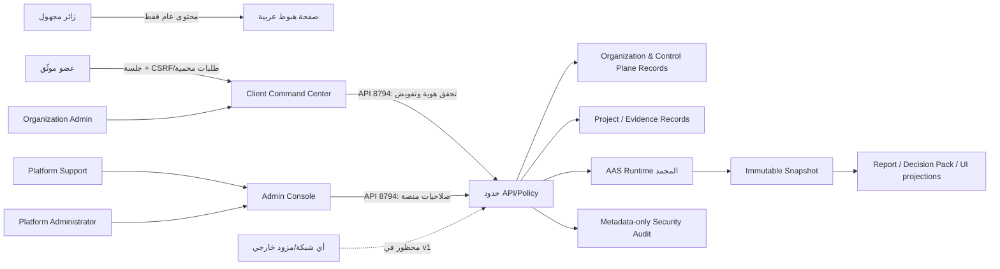

# ASIE PR-00 — Product Blueprint and Security Threat Model

## 1. سجل القرار

- **المعرّف:** `ASIE-PR-00-2026-07-19`
- **الحالة:** `APPROVED — Gate 1 approved on 2026-07-19`
- **النطاق:** قرار المنتج والأمن للإصدار الأول القابل للتسويق؛ لا يتضمن تنفيذاً.
- **خط الأساس:** `AAS Runtime Freeze v1.0` فعال منذ `2026-07-19T00:22:00+03:00`، بتوقيت `Asia/Riyadh`.
- **دليل الخط الأساس المعلن:** 130 اختباراً، `compileall`، و`pnpm build` ناجحة.
- **قيود ثابتة:** الواجهة على `5194` فقط، والـ API على `8794` فقط؛ لا شبكة خارجية، مفاتيح، دفع، API حكومي، أو مزود AI.

### قرار PR-00

ASIE في v1 هو **مرصد قرار عربي أولاً**: يحوّل مدخلات العميل وأدلته المحلية إلى رحلة قرار مفهومة وقابلة للتتبع، لا إلى لوحة مؤشرات تجميلية ولا إلى محرك حكم جديد. الحقيقة الرقمية والحكمية تبقى مملوكة للـ AAS Runtime المجمد؛ كل تقرير وDecision Pack وواجهة هي إسقاط لــ Snapshot محفوظ وغير قابل للتغيير.

لا يصرّح هذا القرار بإنشاء حسابات، تخزين كلمات مرور، أو فتح وصول خارجي. يعرّف فقط نماذج الحقيقة وقواعد القبول التي يجب أن يحققها PR-01 وما بعده.

## 2. العميل المستهدف ووعد المنتج

### العميل الأول

مالك/مدير منشأة أو فريق تحليل استثماري صغير إلى متوسط يحتاج إلى اتخاذ قرار مشروع مبني على أدلة محلية، مع محلل يُدخل البيانات ومراجع بشري يعتمد أو يعلّق على النتيجة. ليس العميل الأول مستخدماً تقنياً ولا مشغّل منصة.

### الوظيفة الحرجة

`اكتشاف ASIE → إنشاء منظمة ومشروع → إدخال بيانات وأدلة → فحص الجاهزية → تشغيل التحليل → فهم القرار وسببه → معالجة المخاطر → العودة إلى Snapshot/Report/Decision Pack`

### الوعد القابل للإثبات

«اعرف القرار الحالي، سببَه، درجة جاهزية أدلته، والخطوة التالية — مع مرجع ثابت يمكن مراجعته لاحقاً.»

لا يجوز تحويل هذا الوعد إلى ادعاء دقة أو عائد أو توفير أو بيانات رسمية أو قدرات AI ما لم يوجد دليل مستقل معتمد.

## 3. تصنيف الأصول والبيانات

| الأصل أو البيانات | التصنيف | مالك الحقيقة | المعالجة/الظهور المسموح | متطلب الحماية |
|---|---|---|---|---|
| محتوى صفحة الهبوط، أمثلة موضحة بوسم Demo | عام | Product content | قراءة عامة فقط؛ لا يختلط ببيانات العميل | مراجعة ادعاءات، منع إدخال أسرار |
| قواميس المنتج، تعريفات KPI، قوالب الرسائل | داخلي | Platform product | مشغلو المنصة المخولون | سجل تعديل ومراجعة نشر |
| ملف المستخدم، العضوية، الدور، الجلسة، الدعوة | سري | Identity/Organization domain (مستقبلاً) | المستخدم المعني أو المشغل المخول | عزل المنظمة، أقل صلاحية، تدقيق |
| اسم المنظمة، حالة الاشتراك المحلية، الحصص والاستخدام | سري | Control Plane domain (مستقبلاً) | المنظمة أو مشغل المنصة بحسب الدور | تفويض على الخادم وسجل سبب التعديل |
| تعريف المشروع ومدخلاته التشغيلية والمالية | سري | Customer project domain | أعضاء المنظمة المخولون فقط | `organization_id` إلزامي، تحقق ملكية المورد |
| ملف مرفوع محلياً، Dataset، سجل المصدر والتحويل | سري/مقيد بحسب المحتوى | Evidence domain + مشروع العميل | أعضاء المشروع المخولون؛ مشاركة دعم مقيدة ومصرح بها | حدود نوع/حجم، عزل تخزين، فحص سجلات، سياسة احتفاظ |
| القيم المالية، المخاطر، خطة التنفيذ، الحكم والـ KPI | سري | AAS sealed outputs ثم Snapshot | إسقاط قراءة فقط للمخولين | لا حساب في المتصفح، لا تعديل بعد الختم |
| Snapshot، hash، report، Decision Pack، lineage | مقيد | Snapshot Assembly | قراءة فقط عبر إسقاطات؛ حفظ مستقل غير قابل للتعديل | تحقق الهوية/hash، منع الكتابة، تدقيق التصدير |
| Human review overlay وaction item | سري | Review/Action domain (مستقبلاً) | أعضاء مخولون؛ لا يبدل Snapshot | فصل صريح عن الحقيقة الأساسية وتدقيق كامل |
| سجل الأمان/التدقيق والحوادث والدعم | مقيد | Security audit / Control Plane | Platform Admin؛ Support ضمن نطاق مفوض | عدم تضمين المحتوى الحساس، عدم قابلية العبث، احتفاظ محدد |
| كلمات المرور، رموز الاستعادة، مفاتيح الجلسات | مقيد جداً | Identity security domain (مستقبلاً) | لا يظهر لأي دور أو عميل | تجزئة كلمة المرور، تخزين رمز بشكل آمن، انتهاء وصرف لمرة واحدة |
| الأسرار ومفاتيح المزودين | مقيد جداً | Secret management (مستقبلاً) | لا واجهة عامة ولا سجلات | لا أسرار حالياً؛ عند الحاجة مخزن أسرار ودوران موثق |

**قاعدة دنيا:** التصنيف يرث للأعلى: إذا احتوى الأصل على بيانات عميل أو محتوى دليل، فهو على الأقل سري. لا تحفظ الأحداث التدقيقية المحتوى الحساس أو كلمات المرور أو الرموز؛ تحفظ نوع الحدث، الممثل، المورد، القرار، correlation/request ID، والطابع الزمني.

## 4. حدود الثقة ونموذج التهديد

### حدود الثقة القابلة للمراجعة

| الحد | ما يدخل | ما لا يعبره أبداً | قرار الثقة |
|---|---|---|---|
| زائر ↔ صفحة عامة | محتوى عام وطلب وصول | بيانات منظمة، أمثلة غير موسومة، أسرار | الزائر غير موثوق |
| متصفح ↔ API | مدخلات محققة وtoken/session | قرار صلاحية صادر من المتصفح، حسابات مالية من React | المتصفح عميل غير موثوق |
| API ↔ Organization/Project | هوية وسياق منظمة صريح | مورد بلا `organization_id` أو افتراض عضوية | الخادم نقطة الإنفاذ الوحيدة |
| Project/Evidence ↔ AAS | مدخلات المشروع المعتمدة محلياً | AI، شبكة خارجية، تنفيذ module مباشر من الواجهة | يحفظ تسلسل وعقد Runtime المجمد |
| AAS ↔ Snapshot ↔ Projections | مخرجات مختومة وهوية/hash | تعديل Snapshot أو إعادة حساب إسقاط الواجهة | Snapshot هو مصدر الإسقاط الوحيد |
| Admin/Support ↔ بيانات العميل | مراجع محددة ومفوضة | وصول عام متعدد المستأجرين أو نسخ محتوى دليل إلى تذكرة | امتياز مرتفع، تدقيق ومعيار سبب |

### سجل التهديدات الأولي

| التهديد/مسار الإساءة | الأصل المتأثر | الضوابط المطلوبة قبل التنفيذ | طريقة التحقق/دليل القبول |
|---|---|---|---|
| مستخدم يقرأ/يكتب مشروع أو Snapshot لمنظمة أخرى (IDOR) | جميع بيانات العميل | `organization_id` إلزامي لكل سجل، تحقق عضوية وملكية على الخادم، deny-by-default | اختبار سلبي لكل route/resource مع معرف منظمة أخرى |
| المتصفح يخفي زرّاً ثم يستدعي endpoint مميزاً | أدوار وسجلات إدارة | policy middleware خادمي ومصفوفة permission؛ UI ليس سلطة | اختبارات لكل permission وطلب مباشر غير مخول = 403 ثابت |
| اختطاف جلسة أو إعادة استعمال recovery token | الهوية | cookie/session آمن، انتهاء/تدوير/إبطال، رمز استعادة لمرة واحدة، rate limits | اختبارات انتهاء وإبطال وإعادة استخدام؛ لا token في logs/browser storage |
| إدخال خبيث أو تحميل ملف كبير/خاطئ | API، evidence، توافر الخدمة | مخططات طلب، allowlist للأنواع، حدود حجم/عدد، أسماء معزولة، أخطاء موحدة | fuzz/negative tests وحالات حد الحجم/النوع |
| XSS/CSRF/CORS متساهل | جلسة وبيانات عميل | CSP وheaders، CSRF حيث يلزم، CORS للأصل المحلي المعتمد فقط، output encoding | اختبارات header وطلبات origin/CSRF مرفوضة |
| تسريب سر أو بيانات حساسة عبر سجل/خطأ/نسخة احتياطية | أسرار، أدلة، هوية | redaction، error policy، scan قبل الإصدار، تشفير backup وسياسة وصول | فحص مصدر/سجل/أرشيف؛ restore drill بلا تسرب |
| العبث بالـ Snapshot أو نسب تقرير إلى Snapshot خاطئ | قرار العميل | تحقق hash/identity قبل الحفظ/العرض، إسقاط read-only، overlay منفصل | اختبار تعديل/عدم تطابق hash يفشل؛ parity report/Decision Pack |
| تكرار Run أو partial failure ينتج Snapshot غير صحيح | سلامة القرار | idempotency وatomic assembly ورفض partial snapshot | replay/failure-injection؛ Snapshot واحد للطلب المتماثل |
| دعم المنصة يتجاوز الحد ويطّلع على محتوى منظمة بلا سبب | سرية العميل | دور Support محدود، grant محدد بزمن/سبب، audit metadata-only | اختبار scope وaudit event؛ مراجعة أحداث الامتياز |
| تعديل حالة اشتراك لإخفاء قرار/مخاطر أو تعطيل وصول تعسفياً | نزاهة المنتج | billing/entitlement منفصل عن Snapshot والحكم، سبب تدقيقي غير قابل للمحو | اختبار عدم تغير truth projections بفعل subscription mutation |
| إساءة استخدام API أو استنزاف التخزين | التوافر | rate/size/concurrency quotas، health/incident records | load/limit tests وأحداث تجاوز الحصة |
| إدخال تكامل/AI/دفع قبل جاهزية الأمن | كل الأصول | gate صريح، `DISABLED + DENY_ALL`، مراجعة تغيير/إذن خارجي | فحص config/routes؛ قرار إطلاق موثق |

### افتراضات ومستبعدات

- التهديدات التي تشمل شبكة خارجية أو مزوداً خارجياً **غير مفعلة وظيفياً** حالياً، لكنها مغطاة كتهديد منع إدخال مبكر.
- لا توجد في PR-00 مطالبة بأن التشفير، التخزين، auth أو النسخ الاحتياطي منفذة؛ هذه ضوابط قبول مستقبلية.
- أي تغيير في ملفات Freeze أو ترتيب pipeline أو sealing boundary يتوقف ويبدأ ACR منفصل.

## 5. نموذج Organization / User / Membership / Role

### نماذج الحقيقة المقترحة لـ PR-01

| الكيان | الحقول الجوهرية | ثوابت الحوكمة |
|---|---|---|
| `User` | `user_id`, display identity, status, created_at | حساب عالمي؛ لا يحمل دور منظمة مباشرة |
| `Organization` | `organization_id`, name, lifecycle_status, created_at | الجذر الصريح لعزل المستأجر؛ لا حذف صامت |
| `Membership` | `membership_id`, `user_id`, `organization_id`, role, status, invited/accepted timestamps | المصدر الوحيد لصلاحية عضو داخل المنظمة؛ فريد لكل user+organization |
| `RoleAssignment` | يشتق أولاً من Membership role؛ لا role builder في v1 | الصلاحيات الخادمية ثابتة ومراجعة، لا تخصيص حر |
| `Session` | `session_id`, `user_id`, issued/expires/revoked, security metadata | لا يضم أسراراً في التدقيق؛ قابل للإبطال |
| `Invitation` | `invitation_id`, org, invited identity, proposed role, expiry, accepted/revoked | token أحادي الاستعمال ومقيد بالمنظمة/الدور |
| `SecurityAuditEvent` | actor, action, target type/id, organization scope where relevant, result, reason, correlation ID, timestamp | immutable append-only؛ metadata فقط |

كل Project وEvidence وDataset وRun وSnapshot وReport projection وDecision Pack projection وReview overlay وAction Item يجب أن يحمل `organization_id` من المصدر الخادمي، لا من اختيار الواجهة. مشاريع العميل لا تصبح عامة عبر رابط أو route ID.

### مصفوفة الصلاحيات الأولية

| القدرة | Platform Admin | Platform Support | Org Owner | Org Admin | Analyst | Reviewer | Viewer |
|---|---:|---:|---:|---:|---:|---:|---:|
| إدارة إعدادات المنصة/حالتها | نعم | لا | لا | لا | لا | لا | لا |
| عرض تدقيق وحوادث المنصة | نعم | ضمن الحاجة | لا | لا | لا | لا | لا |
| إدارة منظمة في نطاق دعم مفوض ومسبب | نعم | نعم، مقيد | لا | لا | لا | لا | لا |
| إدارة عضوية المنظمة وأدوارها | لا | لا | نعم | نعم | لا | لا | لا |
| إنشاء/تعديل مشروع وأدلة محلية | لا | لا | نعم | نعم | نعم | لا | لا |
| تشغيل تحليل مشروع | لا | لا | نعم | نعم | نعم | لا | لا |
| قراءة Snapshots/Report/Decision Pack في المنظمة | لا | فقط بموجب grant | نعم | نعم | نعم | نعم | نعم |
| إضافة Human Review / action (حسب المشروع) | لا | لا | نعم | نعم | نعم | نعم | لا |
| تعديل الحقيقة المختومة داخل Snapshot | لا | لا | لا | لا | لا | لا | لا |
| تعديل subscription/entitlement محلي | نعم | حسب policy وسبب | لا | لا | لا | لا | لا |

**مبادئ إنفاذ:** المنع هو الافتراضي؛ كل mutation يسجل actor وscope وسبب النتيجة؛ Platform roles لا تمنح وصولاً واسعاً إلى بيانات المحتوى تلقائياً؛ والـ Owner هو عضو منظمة لا مالكاً للحقيقة المختومة.

## 6. رحلة العميل الحرجة وKPI

| اللحظة | حاجة العميل | الحالة/المصدر السلطوي | KPI v1 وتعريفه | لا يجوز قياسه أو ادعاؤه |
|---|---|---|---|---|
| الاكتشاف | فهم القيمة دون وعود زائفة | محتوى عام مع Demo label | `Qualified Access Intent Rate` = طلبات وصول مؤهلة / زوار صفحة CTA | توفير أو دقة أو عملاء بلا دليل |
| تهيئة المنظمة/المشروع | بدء مسار واضح | Organization + Project records مستقبلاً | `Time to First Ready Project` = وسيط الزمن من إنشاء المنظمة إلى اجتياز readiness | اكتمال صوري قبل readiness |
| الأدلة والجاهزية | معرفة النواقص تحديداً | Evidence/readiness projections | `Readiness Completion Rate` = مشاريع اجتازت الجاهزية / مشاريع بدأت الإدخال | اعتبار وجود ملف دليلاً صالحاً تلقائياً |
| تشغيل التحليل | نتيجة واحدة قابلة للتتبع | Project Run ثم immutable Snapshot | `First Decision Completion Rate` = مشاريع حصلت على Snapshot صالح / مشاريع جاهزة | احتساب تشغيل فاشل أو مكرر كنجاح |
| فهم القرار | جواب: ما القرار، لماذا، وماذا الآن؟ | Snapshot/Report/Decision Pack projections | `Decision Clarity Success` = نسبة اختبارات usability التي يحدد فيها المستخدم القرار/السبب/الخطوة التالية من شاشة واحدة | استخلاص verdict من بطاقة تجميلية أو AI |
| التصرف والمراجعة | توثيق فعل بشري بلا تغيير الحقيقة | Review overlay + Action Item | `Critical Action Closure` = إجراءات المخاطر الحرجة المغلقة / الإجراءات الحرجة المفتوحة | خلط إغلاق الإجراء مع تغير Snapshot |
| العودة للقرار | مقارنة النسخ والثقة في المرجع | Snapshot history + hashes | `Traceable Decision Return Rate` = جلسات عادت إلى Snapshot/تقرير محدد / جلسات قرار | تعديل نسخة سابقة لتبدو حديثة |

تعريفات القياس الأولية هي تعاقدات منتج، وليست telemetry قيد التشغيل. أي instrument مستقبلي يجب أن يلتزم بتصنيف البيانات، الحد الأدنى من البيانات، وعزل المنظمة.

## 7. معمارية المعلومات: عربية أولاً

### قواعد اللغة وتجربة الاستخدام

- اتجاه RTL هو الافتراضي؛ العربية هي لغة القرار والحالات والأفعال. تبقى المعرفات التقنية (Snapshot ID, hash) قابلة للنسخ كما هي.
- الشاشة بعد الدخول هي مساحة عمل، لا Hero تسويقي. كل حالة تعرض نصاً إضافة إلى اللون/الأيقونة.
- “غير متاح”، “بحاجة إلى إدخال”، “محجوب”، و“قيد المراجعة” حالات صريحة، لا أصفار أو رسوم موحية.
- حركة الواجهة تكشف انتقال حالة حقيقية فقط ولا تصطنع تقدماً أو ثقة.

### صفحة الهبوط العامة

`الوعد → كيف تعمل رحلة القرار → معاينة KPI تجريبية موسومة → إشارات الثقة والحوكمة → حالات الاستخدام → طلب وصول/تسجيل دخول`

- CTA واحد رئيسي: «اطلب الوصول» إلى أن تقرر Gate 3 فتح مسار مناسب.
- معاينات الأمثلة معزولة وموسومة «بيانات توضيحية، ليست قرار عميل».
- لا يظهر Runtime architecture أو أي بيانات عميل أو سجلات تشغيل عامة.

### Client Command Center

`ملخص القرار → الخطوة التالية → الجاهزية والأدلة → مؤشرات القرار → المخاطر والإجراءات → آخر Snapshot والتغير → المشاريع/سجل Snapshots`

- أعلى الشاشة: حالة القرار ودرجة الثقة/الجاهزية و**إجراء واحد تالي** مشتق من حالة الخادم.
- مؤشرات NPV وIRR وفترة الاسترداد واحتياج التمويل واحتمال الجدوى لا تظهر إلا عندما تتوفر في إسقاط Snapshot، وإلا يظهر سبب عدم التوفر.
- drill-down: الأدلة → الجاهزية/lineage؛ القرار → rationale/Report/Decision Pack؛ المخاطر → mitigation/action؛ Snapshot → hash/timeline.
- لا تعرض الواجهة أزرار تشغيل Module أو حسابات مالية محلية أو آليات AAS داخلية.

### Admin Console

`نظرة عامة → المنظمات → المستخدمون والأدوار → الاشتراكات والاستخدام المحلي → الصحة → التدقيق → الدعم → الإشعارات`

- هذا سطح مشغّل منصة منفصل عن تنقل العميل العادي.
- كل بطاقة أو جدول له سجل backend سلطوي، permission معلن، empty state آمن، ومسار audit لكل mutation.
- الدعم يعرض مرجع المنظمة/Snapshot عند التفويض، لا المحتوى المقيد افتراضياً.

## 8. معايير القبول لـ PR-00

| شرط القبول | الدليل المطلوب |
|---|---|
| لا تعديل على AAS Runtime أو Freeze Manifest | مراجعة نطاق التغيير: هذه الوثيقة فقط؛ لا ACR مطلوب |
| لكل فئة بيانات مالك وتصنيف وحد حماية | جدول الأصول في القسم 3 |
| لكل حد ثقة مدخلات ومحظورات وقرار ثقة | القسم 4 ومخططه |
| لكل تهديد P0 مسار وضبط وطريقة تحقق | سجل التهديدات في القسم 4 |
| نموذج عزل منظمة وصلاحيات لا يعتمد على الواجهة | القسم 5 واشتراط الإنفاذ الخادمي |
| رحلة العميل تغطي الحلقة الحرجة كاملة | القسم 6، من الاكتشاف حتى العودة إلى Snapshot |
| KPI لا تنسب حقيقة إلى مصدر غير سلطوي | تعريفات القسم 6 |
| المعلومات العربية الأولى تفصل التسويق عن مساحة العمل والإدارة | القسم 7 |
| لا يبدأ PR-01 قبل اعتماد Gate 1 | قرار صريح من سلطة المنتج/المعمارية |

## 9. النطاق المؤجل صراحةً

- تنفيذ الهوية والجلسات والاستعادة والدعوات أو أي تخزين credentials.
- صفحة هبوط أو هوية بصرية أو UI أو design tokens أو اشتراكات/فوترة فعلية.
- بوابة دفع، card data، ضرائب متعددة العملات، email/SMS/WhatsApp، SSO/SAML، public API.
- أي شبكة أو API حكومي أو مزود AI أو API key أو استدعاء خارجي.
- microservices أو بنية موزعة أو role builder مخصص.
- تعديل runtime المجمد أو ترتيب pipeline أو Snapshot schema/sealing/immutability.

## 10. Gate 1 — قرار مطلوب من المستخدم

لا يبدأ PR-01 إلا إذا اعتمد المستخدم/سلطة المعمارية العناصر الستة التالية:

1. العميل الأول ووعد المنتج في القسم 2.
2. تصنيف الأصول وقاعدة عدم تسريب المحتوى الحساس في التدقيق.
3. حدود الثقة وسجل التهديدات وضوابطها المقترحة.
4. نموذج Organization/User/Membership/Role ومصفوفة الصلاحيات.
5. رحلة العميل وKPI المعرفة دون ادعاءات غير مثبتة.
6. معمارية المعلومات العربية الأولى والفصل بين Landing وClient Command Center وAdmin Console.

**نتيجة Gate 1:** `APPROVED on 2026-07-19`. التنفيذ مخول فقط ضمن حدود PR-01 المعتمدة: `A1 + B0`.
