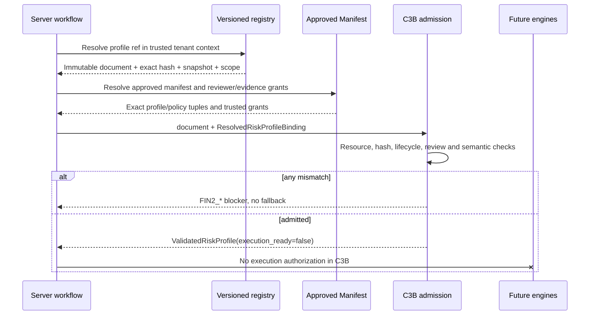

# FINANCE-V2-S2C3B — Governed Risk-Profile Admission

- Status: `IMPLEMENTED_AWAITING_EXACT_HEAD_CI_AND_REVIEW`
- Scope: C3B only
- Governing decision: `ACR-FIN-003`
- Base commit: `d9a14cc3db79064daab808adb9fe72a0d1e2dae8`
- Work branch: `codex/finance-v2-s2c3b-profile-admission`
- Route: `GOVERNED`
- Runtime/Snapshot status: unchanged and not authorized

## 1. Outcome and hard boundary

C3B admits and semantically validates the four governed risk-profile contracts before any financial calculation:

1. `finance-simulation-distribution-profile.v1`
2. `finance-simulation-correlation-profile.v1`
3. `finance-simulation-policy.v1`
4. `finance-sensitivity-profile.v1`

It does **not** sample distributions, execute sensitivity cells, apply correlation, decide convergence, connect Finance v2 to Module Runtime, assemble Snapshots, call providers, or authorize a professional/bank-ready claim. Every successful result carries `execution_ready=False`; an execution request fails with `FIN2_PROFILE_ENGINE_NOT_READY`.

## 2. Source of truth and ownership

The immutable profile document is the source of truth for its schema fields and `content_hash`. The hash is SHA-256 over canonical JSON after deleting only `content_hash`.

Registry and authorization facts are deliberately external to the profile body:

- registry snapshot hash;
- request organization;
- registry entry scope and owner;
- Approved Manifest ID/hash;
- selected policy ref, version and content hash;
- exact manifest profile tuples;
- authorized reviewer identities;
- trusted evidence refs;
- dependency refs/hashes and resolved distribution variable IDs;
- trusted as-of date.

These facts are represented by the server-created `ResolvedRiskProfileBinding`. They are not accepted from a client profile body. Keeping `registry_snapshot_hash` outside the profile avoids a circular dependency between the profile hash and the registry snapshot hash.

## 3. Admission flow

## 4. Binding invariants

Authoritative admission requires all of the following:

- the resolved schema, ID, version and content hash equal the trusted registry tuple;
- the exact tuple is present in `manifest_profiles`;
- the selected policy ref+version+hash tuple is itself pinned in that Approved Manifest;
- an organization-scoped registry entry has an owner equal to the trusted request organization;
- a global entry has no organization owner and requires explicit `allow_global=True`;
- reviewer roles map to distinct trusted reviewer identities;
- every approval evidence ref belongs to the trusted evidence set;
- approval timestamps are not before profile creation or after the trusted as-of date;
- correlation and archetype dependencies match trusted dependency hashes;
- correlation variable IDs equal the resolved distribution variable set.

The binding uses immutable tuples with governed cardinality caps. An authoritative profile must have status `approved`. Draft and intermediate statuses are usable only through the non-admission validation path and remain non-executable.

## 5. Semantic invariants

### Distribution

- exact governed target contract;
- unique, pattern-valid variable IDs;
- non-overlapping scenario targets;
- allowlisted operations and units;
- declared bounds consistent with distribution bounds;
- mode/mean inside bounds and positive stddev/sigma;
- empirical probability length, range and sum;
- calibrated date order, non-future freshness, source/lineage uniqueness;
- historical calibration requires a positive sample.

### Correlation

- distribution dependency bound by ref+hash and exact resolved variable set;
- 2..50 unique governed variable IDs;
- exact square dimensions;
- coefficient range `[-1,1]`;
- governed symmetry, diagonal and PSD tolerances;
- `non_psd_behavior=reject`;
- deterministic Decimal LDLᵀ PSD check with no clipping or nearest-PSD repair.

The PSD check is `O(n^3)` time and `O(n^2)` space, with `n <= 50`.

### Simulation policy

- pinned RNG algorithm, stream derivation and reference vector;
- governed iteration and batch bounds;
- available-batch consistency;
- positive convergence tolerance through at least one of relative/absolute tolerance;
- convergence metrics are an allowlisted subset of output metrics;
- output metrics and quantiles are allowlisted and unique;
- thresholds target declared outputs and are non-duplicated;
- convergence failure remains `not_ready`.

### Sensitivity

- exactly two unique, pattern-valid axes;
- unique values per axis;
- no target overlap between axes and fixed overrides;
- allowlisted metrics;
- actual cell product does not exceed the declared maximum and hard cap 441.

## 6. Threat, control and test map

| Threat/failure | Control | Required evidence |
|---|---|---|
| client profile substitution | canonical hash + exact trusted tuple | hash/ref substitution negatives |
| unapproved manifest selection | exact profile and policy ref+version+hash membership | missing profile/policy negatives |
| cross-tenant registry entry | server-bound scope/owner comparison | organization/global negatives |
| forged reviewer or evidence | role→identity and evidence allowlists | forged identity/evidence negatives |
| future/stale governance record | created/review/as-of and calibration ordering | future review/calibration negatives |
| unbounded object | pre-hash depth/node/text/cardinality limits | float/depth/malformed-type negatives |
| overlapping financial target | parsed target overlap rejection | wildcard/month and fixed-target negatives |
| invalid probability model | bounds/sigma/probability invariants | probability/sigma negatives |
| invalid correlation | dependency-variable equality + range/symmetry/diagonal/PSD | mismatch, singular-boundary and non-PSD tests |
| ineffective convergence policy | batch/tolerance/metric consistency | impossible/zero/missing-output negatives |
| premature engine use | hard `execution_ready=False` | engine-not-ready test |

## 7. Failure and rollback behavior

All failures are stable `FIN2_*` contract errors. There is no clipping, implicit default, fallback profile, nearest-PSD repair, tenant fallback, or client authority.

C3B is a dark-build module and additive tests/documentation. Rollback is a single revert of the C3B commit. No database migration, feature flag, runtime route, provider, or external network state is introduced.

## 8. Evidence gate

C3B cannot advance until all are true on one exact branch head:

- targeted C3B tests pass;
- full ASIE CI passes;
- cross-platform workflow passes;
- independent code review has no unresolved actionable findings;
- protected Finance v1, Module Runtime and Snapshot Assembly blobs remain unchanged;
- final evidence records the exact head SHA and workflow URLs.

Until then the status remains `IMPLEMENTED_AWAITING_EXACT_HEAD_CI_AND_REVIEW`. Passing C3B does not satisfy C3C–C3F or professional/financial-institution readiness.
