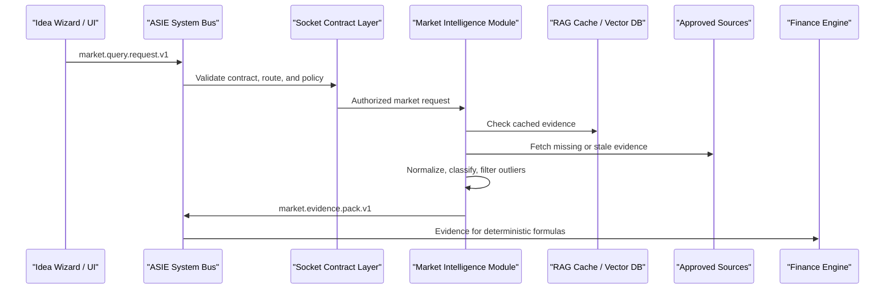

Document ID: AAS-18
Document Name: ASIE Message Flow Specification
Version: 1.0.0
Status: Frozen
Classification: Enterprise Architecture Specification
Owner: ASIE Architecture Board
Authority: ASIE Architecture Board
Parent References:

AAS-01 — ASIE Constitution
AAS-02 — ASIE Operating Architecture
AAS-11 — ASIE Platform Protocol (APP) Specification
AAS-15 — ASIE System Bus Specification
AAS-16 — ASIE Socket Contract Layer Specification
AAS-17 — ASIE Module Specification
Architecture: Frozen Architecture
Last Updated: 2026-07-11
AAS-18 — ASIE Message Flow Specification
مواصفة ASIE Message Flow
1. الغرض من الوثيقة

تُعد هذه الوثيقة المواصفة الرسمية لـ ASIE Message Flow ضمن ASIE Architecture Standard (AAS).

تُحدد هذه الوثيقة المسار التشغيلي الكامل للرسائل داخل منصة ASIE، من لحظة إنشائها، مرورًا بالتحقق والتوجيه والتسليم، وصولًا إلى الاستجابة أو الرفض أو الفشل أو العزل.

ولا تُنشئ هذه الوثيقة بروتوكولًا جديدًا، ولا قناة رسائل بديلة، ولا تسمح باتصال مباشر بين Modules، بل تفصل حركة الرسائل المعتمدة وفق APP وASIE System Bus وSocket Contract Layer.

2. السلطة والمرجعية

تخضع هذه الوثيقة بالكامل لأحكام:

AAS-01 — ASIE Constitution
AAS-02 — ASIE Operating Architecture
AAS-11 — ASIE Platform Protocol (APP) Specification
AAS-15 — ASIE System Bus Specification
AAS-16 — ASIE Socket Contract Layer Specification
AAS-17 — ASIE Module Specification

وفي حال تعارض أي نص في هذه الوثيقة مع AAS-01، تكون الأولوية الملزمة لـ AAS-01.

وفي حال تعارض أي تفصيل متعلق ببنية الرسالة مع AAS-11، تكون الأولوية لـ AAS-11.

وفي حال تعارض أي تفصيل متعلق بقناة التمرير مع AAS-15، تكون الأولوية لـ AAS-15 ما لم يخالف ذلك AAS-01 أو AAS-02.

3. تعريف ASIE Message Flow

يُعد ASIE Message Flow المسار التشغيلي المعتمد الذي تتحرك من خلاله APP Messages داخل منصة ASIE عبر ASIE System Bus.

ويشمل Message Flow:

إنشاء الرسالة.
ربطها بـ Contract وSocket.
تحقق السياق الأمني.
إرسالها إلى ASIE System Bus.
التحقق من قابليتها للتمرير.
توجيهها إلى الوجهة المعتمدة.
تسليمها.
معالجة الاستجابة أو الخطأ.
تسجيل حالتها.
عزلها عند الحاجة.
4. القاعدة الدستورية لـ Message Flow

تلتزم منصة ASIE بالقاعدة التالية:

Every internal message follows the approved Message Flow.
No message bypasses APP, Contract, Socket, or ASIE System Bus.

وبناءً على ذلك:

لا توجد رسالة داخلية خارج APP.
لا توجد رسالة دون Contract.
لا توجد رسالة دون Socket.
لا توجد رسالة خارج ASIE System Bus.
لا توجد رسالة من مصدر مجهول.
لا توجد رسالة إلى وجهة غير معتمدة.
لا توجد قناة جانبية بين Modules.
القسم الأول: نطاق ASIE Message Flow
5. ما تحكمه هذه الوثيقة

تحكم هذه الوثيقة الجوانب التالية:

مسار الرسالة الداخلي.
مراحل تدفق الرسالة.
حالات الرسالة.
شروط قبول الرسالة.
شروط رفض الرسالة.
علاقة الرسالة بـ APP.
علاقة الرسالة بـ Contract وSocket.
علاقة الرسالة بـ ASIE System Bus.
علاقة الرسالة بـ Module.
التعامل مع الاستجابة والخطأ.
Retry وTimeout.
العزل والفشل.
التتبع والتدقيق.
6. ما لا تحكمه هذه الوثيقة

لا تحكم هذه الوثيقة:

تصميم APP نفسه.
تفاصيل تنفيذ ASIE System Bus.
تفاصيل Socket Contract Layer.
إدارة Modules التفصيلية.
إدارة القلوب.
تصميم APIs الخارجية.
تفاصيل Deployment.
تفاصيل قواعد البيانات.
منطق الأعمال داخل Modules.

هذه الجوانب تُفصل في وثائق AAS المتخصصة.

القسم الثاني: مبادئ Message Flow
7. Flow Must Be Explicit

يجب أن يكون كل Message Flow صريحًا وقابلًا للتتبع.

ولا يجوز وجود تدفق ضمني أو غير موثق أو غير قابل للتحقق.

8. Flow Must Be Contracted

يجب أن يرتبط كل Message Flow بـ Contract معتمد.

ولا يجوز تنفيذ تدفق رسائل لا يمكن تفسيره وفق Contract.

9. Flow Must Be Socket-Bound

يجب أن يمر كل Message Flow عبر Socket Binding صالح عند ارتباطه بـ Module.

ولا يجوز أن تشارك Module في Flow دون Socket صالح.

10. Flow Must Use ASIE System Bus

يجب أن تمر جميع التدفقات عبر ASIE System Bus.

ويُحظر أي تدفق مباشر بين Modules أو بين Module ومكون آخر خارج القواعد المعتمدة.

11. Flow Must Be Secure

يجب أن يحمل كل Message Flow سياقًا أمنيًا صالحًا.

ولا يجوز استمرار تدفق فشل في Security Context.

12. Flow Must Be Contained

يجب أن يكون أي فشل داخل Message Flow قابلًا للاحتواء.

ولا يجوز أن يؤدي فشل رسالة إلى انهيار النظام أو تعطيل بقية Modules.

القسم الثالث: البنية الأساسية لتدفق الرسالة
13. مراحل Message Flow

يمر Message Flow بالمراحل التالية:

Message Creation.
Source Validation.
Contract Binding.
Socket Binding Validation.
Security Context Validation.
Payload Validation.
Submission to ASIE System Bus.
Routing Decision.
Destination Validation.
Delivery.
Processing.
Response أو Error Handling.
State Recording.
Completion أو Failure أو Isolation.
14. Message Creation

تُنشأ الرسالة من مصدر معتمد.

ويجب أن تكون الرسالة APP-compliant منذ إنشائها.

ولا يجوز إنشاء رسالة ناقصة ثم تمريرها للتصحيح أثناء التدفق.

15. Source Validation

يجب التحقق من أن Source:

مسجل.
مصرح.
مرتبط بسياق أمني صالح.
مخول بإرسال Message Type.
ملتزم بـ Contract وSocket عند كونه Module.
16. Contract Binding

يجب ربط الرسالة بـ Contract ID صالح قبل تمريرها.

ولا يجوز أن تكون الرسالة معتمدة على Implementation أو مزود خارجي بدل Contract.

17. Socket Binding Validation

إذا كان Source أو Destination هو Module، يجب التحقق من Socket Binding.

ويُرفض التدفق إذا كان Socket Binding غير صالح أو غير موجود.

18. Security Context Validation

يجب التحقق من Security Context قبل Routing.

ويُحظر تمرير الرسالة إذا كان السياق الأمني غير صالح أو غير كافٍ.

19. Payload Validation

يجب التحقق من Payload وفق Contract.

ويجب رفض Payload إذا كانت:

ناقصة.
زائدة بطريقة غير مبررة.
غير مطابقة.
تحتوي Implementation غير معتمد.
تسمح بتجاوز Contract.
تنقل AI Output كحقيقة نهائية في المجالات المحظورة.
20. Submission to ASIE System Bus

بعد اكتمال الشروط السابقة، تُرسل الرسالة إلى ASIE System Bus.

ولا يجوز إرسالها مباشرة إلى Destination.

21. Routing Decision

يُحدد ASIE System Bus وجهة الرسالة وفق:

Destination.
Contract.
Socket.
Registry.
Operational State.
Security Context.
Message Type.

ولا يجوز أن يستند Routing إلى منطق أعمال أو مزود خارجي.

22. Destination Validation

يجب التحقق من أن Destination:

مسجلة.
مصرح لها.
متاحة تشغيليًا.
ملتزمة بـ Socket وContract إذا كانت Module.
ليست معزولة.
قادرة على استقبال Message Type.
23. Delivery

تُسلم الرسالة إلى Destination المعتمدة عبر ASIE System Bus.

ويجب أن يحافظ التسليم على:

Message ID.
Correlation ID.
Security Context.
Contract ID.
Socket ID.
Trace Metadata عند الحاجة.
24. Processing

تعالج Destination الرسالة ضمن حدود Contract.

ولا يجوز أن يؤدي Processing إلى:

تجاوز Contract.
استدعاء Module أخرى مباشرة.
تجاوز ASIE System Bus.
استخدام AI كمصدر حقيقة نهائية.
تعديل ASIE Kernel.
كسر Security Context.
25. Response أو Error Handling

بعد Processing، ينتج أحد المسارات:

Response Message.
Error Message.
Event Message.
No Response إذا كان Contract يسمح بذلك.
Failure State.
Isolation Trigger.

ويجب أن يلتزم الناتج بـ APP وCorrelation ID عند الحاجة.

26. State Recording

يجب تسجيل الحالة التشغيلية للرسالة بما يكفي للتتبع والتدقيق.

ولا يعني ذلك تخزين Payload كامل دائمًا إذا كان ذلك يخالف الأمن أو الخصوصية أو الأداء.

27. Completion

يُعد Message Flow مكتملًا إذا:

تم تسليم الرسالة ومعالجتها وفق Contract.
تم إصدار Response أو Event عند الحاجة.
تم تسجيل الحالة المطلوبة.
لم يبقَ فشل غير معالج.
28. Failure أو Isolation

إذا فشل التدفق أو شكّل خطرًا، يجب نقله إلى Failure أو Isolation وفق القواعد المعتمدة.

القسم الرابع: حالات Message Flow
29. الحالات المعتمدة

تخضع الرسالة للحالات التالية:

الحالة	الوصف
Created	تم إنشاء الرسالة
Source Validated	تم التحقق من المصدر
Contract Bound	تم ربط الرسالة بعقد
Socket Validated	تم التحقق من السوكيت
Security Validated	تم التحقق الأمني
Payload Validated	تم التحقق من الحمولة
Submitted	أُرسلت إلى ASIE System Bus
Routing	الرسالة قيد التوجيه
Destination Validated	تم التحقق من الوجهة
Delivered	تم تسليم الرسالة
Processing	الرسالة قيد المعالجة
Responded	تم إصدار استجابة
Completed	اكتمل التدفق
Rejected	تم رفض الرسالة
Failed	فشل التدفق
Isolated	تم عزل الرسالة أو التدفق
Expired	انتهت صلاحية الرسالة
Retried	تمت إعادة المحاولة وفق سياسة معتمدة
30. منع الحالات غير المضبوطة

لا يجوز ترك الرسالة في حالة غير نهائية دون Timeout أو سياسة معالجة.

ويُحظر وجود تدفقات معلقة بلا حدود.

31. Transition Rules

يجب أن تكون انتقالات الحالة صريحة وقابلة للتتبع.

ولا يجوز الانتقال من Created إلى Delivered دون المرور بالتحقق المطلوب.

القسم الخامس: أنواع التدفقات
32. Command Flow

يُستخدم Command Flow لطلب تنفيذ فعل محدد.

ويجب أن يكون:

مرتبطًا بـ Contract.
محدد Destination.
قابلًا للتحقق.
خاضعًا لـ Security Context.
غير متجاوز لـ ASIE System Bus.
33. Query Flow

يُستخدم Query Flow لطلب قراءة أو استعلام.

ولا يجوز أن ينتج Query Flow آثارًا جانبية غير مصرح بها في Contract.

34. Event Flow

يُستخدم Event Flow للإبلاغ عن حدث أو تغير حالة.

ولا يُعد Event Flow أمرًا مباشرًا إلا إذا عالجه Contract آخر بصورة صريحة.

35. Response Flow

يُستخدم Response Flow لإرجاع نتيجة مرتبطة برسالة سابقة.

ويجب أن يحافظ على Correlation ID الخاص بالتدفق الأصلي.

36. Error Flow

يُستخدم Error Flow للإبلاغ عن فشل أو رفض أو خطأ.

ويجب ألا يؤدي Error Flow إلى سلسلة أخطاء غير محدودة.

37. Health Flow

يُستخدم Health Flow للإبلاغ عن حالة صحية لمكون أو Module أو Heart.

ويجب أن يكون مبنيًا على مؤشرات قابلة للقياس.

38. Control Flow

يُستخدم Control Flow لأغراض تشغيلية محدودة، مثل التفعيل أو التعطيل أو العزل.

ولا يجوز أن يتحول Control Flow إلى قناة Business Logic أو قناة تجاوز للعقود.

القسم السادس: شروط قبول Message Flow
39. شروط القبول

يُقبل Message Flow إذا تحققت الشروط التالية:

الرسالة APP-compliant.
Source مسجل ومصرح.
Destination مسجلة ومصرح لها.
Contract ID صالح.
Socket ID صالح عند الحاجة.
Security Context صالح.
Payload مطابق.
Message Type معتمد.
الحالة التشغيلية تسمح بالتدفق.
لا يوجد تجاوز لـ ASIE System Bus.
لا يوجد اتصال مباشر بين Modules.
40. شروط الرفض

يُرفض Message Flow إذا تحقق أي مما يلي:

رسالة غير متوافقة مع APP.
مصدر مجهول.
وجهة غير مسجلة.
غياب Contract.
غياب Socket عند الحاجة.
فشل Security Context.
Payload غير مطابق.
Message Type غير معتمد.
Destination معزولة.
Source معزول.
محاولة تجاوز ASIE System Bus.
محاولة اتصال مباشر.
محاولة تمرير نتيجة AI كحقيقة نهائية محظورة.
محاولة تنفيذ Business Logic داخل ASIE System Bus.
القسم السابع: Retry وTimeout
41. Retry Policy

يجوز إعادة محاولة Message Flow فقط إذا كانت Retry Policy معتمدة.

ويجب أن تكون Retry Policy:

محدودة.
قابلة للتتبع.
مرتبطة بـ Contract أو سياسة تشغيلية.
غير مسببة لتضخيم الحمل.
غير مؤدية لفشل متسلسل.
42. منع Retry غير المحدود

يُحظر Retry غير المحدود.

ويُعد وجود إعادة محاولة غير محدودة خطرًا تشغيليًا ومعماريًا.

43. Timeout Policy

يجب أن يحتوي أي تدفق قابل للتعليق على Timeout Policy مناسبة.

ويجب أن تمنع Timeout Policy:

احتجاز الموارد.
انتظار Module متعطلة بلا حد.
تعطيل ASIE System Bus.
تحميل القلوب بلا مبرر.
44. انتهاء صلاحية الرسالة

إذا انتهت صلاحية الرسالة، يجب نقلها إلى Expired أو Failed وفق السياسة المعتمدة.

ولا يجوز استمرار معالجتها بعد انتهاء صلاحيتها إلا إذا نص Contract على سلوك آمن ومحدد.

القسم الثامن: الفشل والعزل
45. فشل Message Flow

يُعد Message Flow فاشلًا إذا تعذر إكماله وفق Contract وAPP وASIE System Bus.

وتشمل أسباب الفشل:

فشل Source Validation.
فشل Destination Validation.
فشل Contract Validation.
فشل Socket Validation.
فشل Security Context.
فشل Payload Validation.
Timeout.
فشل Processing.
Destination معزولة.
محاولة تجاوز القواعد المعمارية.
46. عزل Message Flow

يجب عزل Message Flow إذا تسبب أو قد يتسبب في خطر تشغيلي.

وتشمل أسباب العزل:

تكرار فشل مفرط.
Payload ضار أو غير منضبط.
مصدر مخالف.
Destination متدهورة.
محاولة تجاوز ASIE System Bus.
محاولة تصعيد صلاحيات.
تأثير سلبي على القلوب.
تأثير سلبي على ASIE System Bus.
47. أثر العزل

عند عزل Message Flow، يجب:

وقف التمرير.
تسجيل الحالة.
إبلاغ ASIE System Bus.
إبلاغ Bus Controller إذا تعلق التدفق بـ Module.
إبلاغ Heart Controller إذا وُجد أثر تشغيلي.
تحديث Registry عند الحاجة.
منع تكرار التدفق المخالف.
48. منع انتشار الفشل

يجب ألا يؤدي فشل Message Flow واحد إلى انهيار النظام.

ويجب احتواء الفشل في الرسالة أو التدفق أو Module المتأثرة قدر الإمكان.

القسم التاسع: التتبع والتدقيق
49. Traceability

يجب أن يكون كل Message Flow قابلًا للتتبع عبر:

Message ID.
Correlation ID.
Source.
Destination.
Contract ID.
Socket ID.
Message Type.
Flow State.
Timestamp.
Security Context Reference.
50. Correlation ID

يجب استخدام Correlation ID لربط الرسائل المرتبطة بتدفق واحد.

ولا يجوز فقدان Correlation ID أثناء Response أو Error Flow.

51. Auditability

يجب أن يكون Message Flow قابلًا للتدقيق بما يكفي لاكتشاف:

فشل التحقق.
تجاوز العقود.
محاولات الاتصال المباشر.
أخطاء الأداء.
تكرار الفشل.
الانحرافات الأمنية.
52. حماية بيانات التتبع

لا يجوز أن يؤدي التتبع إلى كشف أسرار أو Payload حساسة أو تفاصيل أمنية غير مصرح بها.

القسم العاشر: العلاقة مع Modules
53. إرسال الرسائل من Module

لا يجوز لـ Module إرسال رسالة إلا إذا كانت:

مفعلة.
غير معزولة.
مرتبطة بـ Socket.
ملتزمة بـ Contract.
مصرحًا لها أمنيًا.
مرسلة عبر ASIE System Bus.
54. استقبال الرسائل من Module

لا يجوز لـ Module استقبال رسالة إلا إذا كانت:

موجهة إليها.
قادمة عبر ASIE System Bus.
متوافقة مع APP.
مطابقة لـ Contract.
مرتبطة بـ Socket.
مصرحًا بها أمنيًا.
55. منع القنوات الجانبية

يُحظر على Module إنشاء قنوات جانبية لتبادل الرسائل أو البيانات مع Module أخرى.

القسم الحادي عشر: العلاقة مع ASIE System Bus
56. ASIE System Bus هو حامل التدفق

يُعد ASIE System Bus حامل Message Flow.

ولا يجوز لأي مكون آخر أن يحل محله في تمرير الرسائل.

57. عدم تحميل ASIE System Bus منطق الأعمال

لا يجوز أن يحتوي Message Flow داخل ASIE System Bus على Business Logic.

ويجب أن يبقى ASIE System Bus مسؤولًا عن التمرير والدعم التشغيلي فقط.

القسم الثاني عشر: العلاقة مع Socket Contract Layer
58. Socket Contract Layer تتحقق من الالتزام

تدعم Socket Contract Layer التحقق من أن الرسائل والتدفقات ملتزمة بـ Socket وContract.

ولا يجوز تجاوزها عند قبول Module أو Message Flow.

59. أثر فشل Socket على Message Flow

إذا فشل Socket Binding أو Contract Compliance، يجب رفض أو عزل Message Flow.

القسم الثالث عشر: العلاقة مع Heart Controller والقلوب
60. أثر Message Flow على القلوب

إذا تسبب Message Flow في ضغط أو فشل أو حالة Degraded، يجب إبلاغ Heart Controller.

61. منع القلوب من تجاوز Message Flow

لا يجوز لأي Heart إنشاء أو تمرير تدفق رسائل يخالف APP أو ASIE System Bus أو Contracts.

القسم الرابع عشر: العلاقة مع AI
62. AI داخل Message Flow

يجوز أن يمر طلب AI داخل Message Flow إذا كان خلف Contract معتمد.

ولا يجوز أن يتجاوز AI قواعد APP أو ASIE System Bus أو Socket Contract Layer.

63. منع AI كحقيقة نهائية

لا يجوز أن تمر مخرجات AI بوصفها حقيقة نهائية في المجالات المحظورة دستوريًا.

وتبقى القاعدة:

Deterministic Code Owns the Truth. AI Explains the Truth.

القسم الخامس عشر: الأداء
64. الأداء كقيد في Message Flow

يُعد الأداء قيدًا ملزمًا في Message Flow.

ويجب أن يمنع التدفق:

الرسائل الزائدة.
Payload غير اللازم.
Retry غير المحدود.
Timeout غير المضبوط.
تحميل القلوب بلا مبرر.
استدعاء AI بلا حاجة.
التدفقات غير القابلة للتتبع.
65. منع التدفقات غير المنضبطة

يُحظر وجود Message Flow غير محدود أو غير قابل للإيقاف أو غير قابل للتتبع.

القسم السادس عشر: المحظورات الخاصة بـ Message Flow
66. محظورات Message Flow

يُحظر في ASIE Message Flow ما يلي:

رسالة دون APP.
رسالة دون Contract.
رسالة دون Socket عند الحاجة.
رسالة خارج ASIE System Bus.
رسالة من مصدر مجهول.
رسالة إلى وجهة غير معتمدة.
اتصال مباشر بين Modules.
قناة جانبية للرسائل.
Retry غير محدود.
Timeout غير محدد للتدفقات القابلة للتعليق.
Payload غير منضبط.
Business Logic داخل ASIE System Bus.
AI كمصدر حقيقة نهائية.
تجاوز Security Context.
تجاهل حالة Module المعزولة.
67. مخالفة Message Flow

تُعد مخالفة Message Flow مخالفة تشغيلية ومعمارية.

ويجب عند اكتشافها:

رفض الرسالة أو التدفق.
عزل التدفق عند الحاجة.
إبلاغ ASIE System Bus.
إبلاغ Bus Controller إذا تعلق الأمر بـ Module.
إبلاغ Heart Controller إذا وُجد أثر تشغيلي.
تحديث Registry عند الحاجة.
مراجعة المخالفة وفق AAS-01 وAAS-02 وAAS-11 وAAS-15 وAAS-16.
القسم السابع عشر: معايير التحقق من الالتزام
68. معايير قبول Message Flow

يُقبل Message Flow معماريًا إذا حقق الآتي:

يبدأ من مصدر معتمد.
يلتزم بـ APP.
يرتبط بـ Contract.
يرتبط بـ Socket عند الحاجة.
يحمل Security Context صالحًا.
يمر عبر ASIE System Bus.
يصل إلى Destination معتمدة.
يحافظ على Correlation ID عند الحاجة.
يخضع لـ Retry وTimeout مضبوطين.
لا يحتوي Business Logic داخل قناة الرسائل.
لا يسمح بـ AI كحقيقة نهائية.
يبقى قابلًا للتتبع والعزل.
69. مؤشرات الانحراف المعماري

تُعد الحالات التالية مؤشرات انحراف:

رسائل بين Modules مباشرة.
رسائل تمر دون Contract.
رسائل تمر دون Socket.
رسائل غير قابلة للتتبع.
Retry غير محدود.
Timeout مفقود.
Payload فضفاضة.
AI Output يعامل كحقيقة نهائية.
ASIE System Bus ينفذ Business Logic.
تدفق فشل يسقط النظام.
القسم الثامن عشر: العلاقة مع وثائق AAS الأخرى
70. الوثائق المرتبطة

ترتبط هذه الوثيقة بالوثائق التالية:

AAS-01 — ASIE Constitution
AAS-02 — ASIE Operating Architecture
AAS-10 — ASIE Kernel Specification
AAS-11 — ASIE Platform Protocol (APP) Specification
AAS-12 — ASIE Heart Controller Specification
AAS-13 — ASIE Three Hearts Specification
AAS-14 — ASIE Bus Controller Specification
AAS-15 — ASIE System Bus Specification
AAS-16 — ASIE Socket Contract Layer Specification
AAS-17 — ASIE Module Specification
AAS-20 — ASIE Zero Trust Security Specification
AAS-40 — ASIE AI Integration Specification
AAS-60 — ASIE API Specification

ولا يجوز لأي وثيقة منها أن تُفسر Message Flow بما يسمح بتجاوز APP أو ASIE System Bus أو Contracts أو Socket Contract Layer.

أحكام ختامية
71. الأثر الملزم

تُعد AAS-18 — ASIE Message Flow Specification المرجع الرسمي الحاكم لمسار الرسائل داخل منصة ASIE.

ويلتزم كل تصميم أو تنفيذ أو مراجعة أو تطوير متعلق بالرسائل والتدفقات والاستجابات والأخطاء والعزل بأحكام هذه الوثيقة.

72. حدود التعديل

لا يجوز تعديل Message Flow أو إنشاء قناة جانبية أو السماح برسائل خارج ASIE System Bus إلا عبر Architecture Change Proposal (ACP) معتمد إذا كان التغيير يمس Frozen Architecture.

73. الصفة النهائية

تُعتمد هذه الوثيقة بوصفها المواصفة الرسمية لـ ASIE Message Flow ضمن ASIE Architecture Standard (AAS).

وبموجبها، لا تُعد أي رسالة داخلية صحيحة داخل منصة ASIE إلا إذا التزمت بـ APP، وارتبطت بـ Contract وSocket عند الحاجة، ومرت عبر ASIE System Bus، وخضعت للتحقق والتتبع والعزل وفق هذه المواصفة.

End of Document

ــــــــــــــــــــــــــــــــــــــــــــــــــــــــــــــــــــــــــــــــــــــــــــــــــــــــــــــــــــــــــــــــــــــــــــــــــــــــــــــــــــــــــــــــــــــــــــــــــــــــــــــــــــــــــــــــــــــــــــــــــــــــــــــــــــــــــــــــــــــــــــــــــــــــــــــــــــــــــــــــــ

AAS-20 ASIE Zero Trust Security Specification


ASIE Architecture Standard (AAS)

---

# ملحق رسمي: Market Evidence Message Flow

يُضاف التدفق التالي إلى **AAS-18 — ASIE Message Flow Specification** بوصفه المسار المعتمد لتدفق Market Evidence داخل ASIE.



## Negative Test: Direct Market Provider Access

```text
Given: An AI Agent, UI component, Plugin, or Module attempts to call a market provider directly
When: The call bypasses market Socket Contracts
Then: Socket Contract Layer rejects the operation
And: Zero Trust records a security event
And: Audit records the attempted bypass
```

## Negative Test: AI-Generated Market Numbers

```text
Given: An AI Agent attempts to fill missing market or financial values by estimation
When: The value is not backed by Evidence Pack or deterministic formula
Then: The output is rejected
And: The response must request more evidence or mark the field unavailable
```

