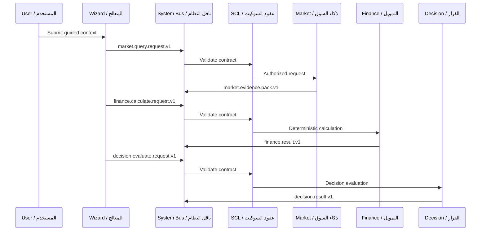
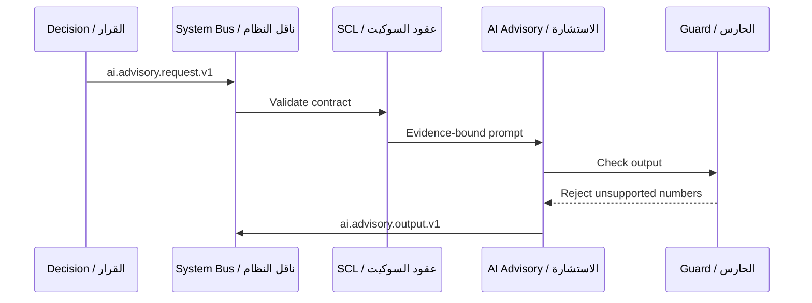
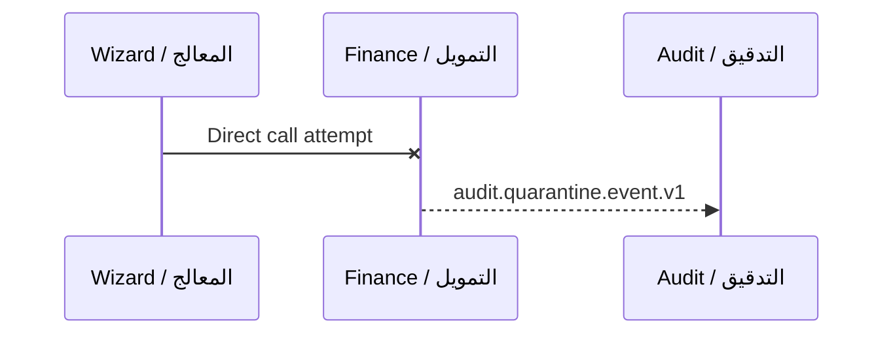
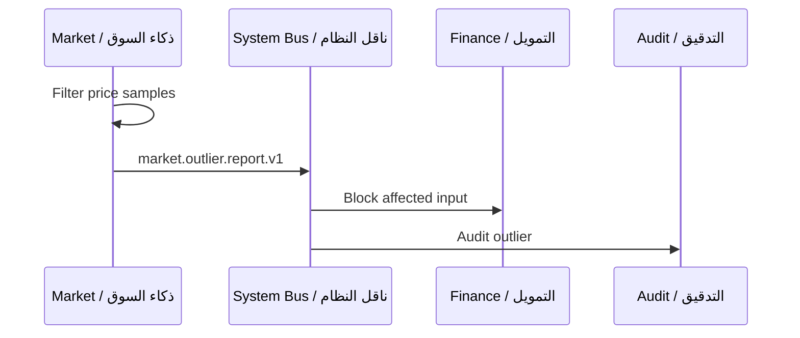
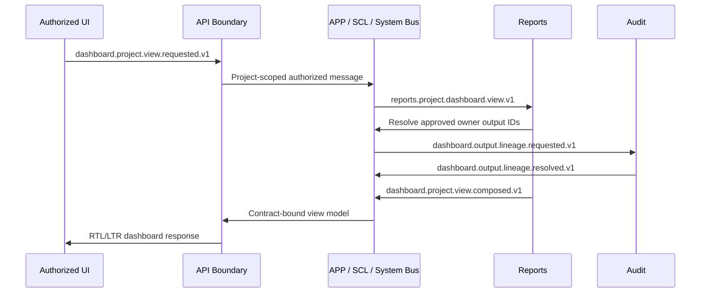

# Execution Flows

## تدفقات التنفيذ

## Flow 1: Project Analysis

## التدفق 1: تحليل المشروع

## Flow 2: AI Advisory

## التدفق 2: الاستشارة بالذكاء الاصطناعي

## Flow 3: Negative Direct Module Call

## التدفق 3: رفض الاتصال المباشر

## Flow 4: Market Outlier

## التدفق 4: شذوذ السعر

## Flow 5: Project Dashboard Composition

## التدفق 5: تكوين لوحة المشروع

Rules:

- Reports composes; it does not recalculate.
- Owner outputs remain owned by their existing Modules.
- Any cross-project, missing-contract, stale-disallowed, lineage-invalid, or permission-denied output is blocked and audited.

## Professional Feasibility Flow r15

1. UI submits project purpose/context through `project.feasibility.profile.v1`.
2. Project Wizard applies `FST-ALG-01` and emits the selected minimum profile.
3. Existing owner Modules produce their chapter outputs through approved contracts and message types.
4. Finance Engine executes applicable `FIN-ALG-06` through `FIN-ALG-12` from approved inputs only.
5. Audit / Observability reviews procurement references and methodology cards; blocked commercial content never enters AI/RAG.
6. Decision Council applies `FST-ALG-02`, `FST-ALG-03`, `PROC-ALG-01`, and the existing decision gates.
7. Reports composes dashboard/report output without recalculation and preserves chapter state and lineage.
8. Audit records profile, evidence, assumptions, formulas, official-form decisions, contradictions, decisions, and exports.

Failure branches:

- Missing mandatory chapter -> `feasibility.study.composition.blocked.v1`.
- Cross-study mismatch -> contradiction register and affected outputs blocked.
- Unbalanced statements or mixed financial bases -> `finance.feasibility.advanced.blocked.v1`.
- Missing exact competition package -> `procurement.exact.documents.required.v1`.
- Aljdwa or other commercial page requested for automated access -> `methodology.commercial.access.blocked.v1` and audit event.
